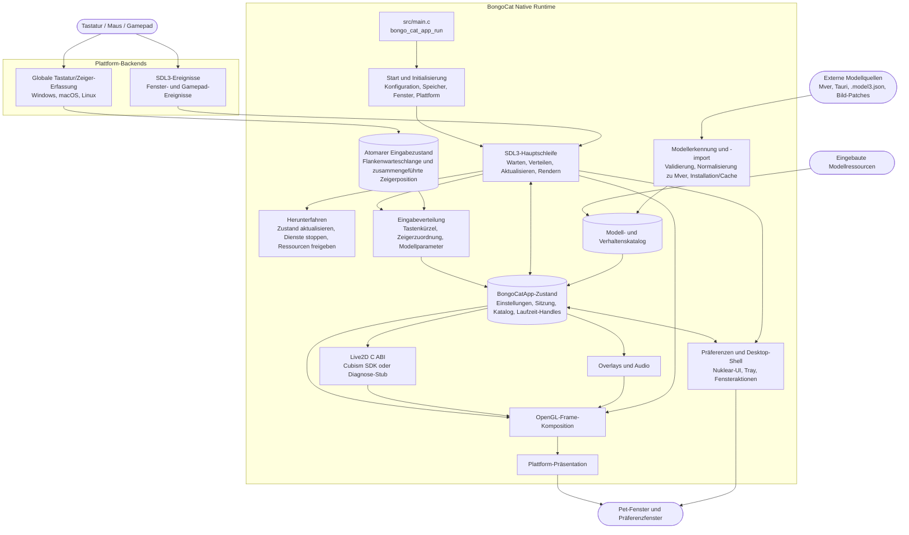

<div align="center">
  <a href="https://bongocat.pet" target="_blank">
    
  </a>
  <h1><a href="https://bongocat.pet" target="_blank">BongoCat</a></h1>
</div>

<p align="center">💘 C/C++ × SDL3 × OpenGL, zusammenrühren, drauflos trommeln! Bong~ Bongo Cat!!!</p>
<p align="center">
  Sprache wählen ❯ <a href="https://github.com/vladelaina/BongoCat/blob/main/README.md">English</a> • <a href="https://github.com/vladelaina/BongoCat/blob/main/docs/README.zh-CN.md">简体中文</a> • <a href="https://github.com/vladelaina/BongoCat/blob/main/docs/README.zh-Hant.md">繁體中文</a> • <a href="https://github.com/vladelaina/BongoCat/blob/main/docs/README.fr-FR.md">Français</a> • <strong>Deutsch</strong> • <a href="https://github.com/vladelaina/BongoCat/blob/main/docs/README.ja-JP.md">日本語</a> • <a href="https://github.com/vladelaina/BongoCat/blob/main/docs/README.ko-KR.md">한국어</a> • <a href="https://github.com/vladelaina/BongoCat/blob/main/docs/README.pt-BR.md">Português</a> • <a href="https://github.com/vladelaina/BongoCat/blob/main/docs/README.ru-RU.md">Русский</a> • <a href="https://github.com/vladelaina/BongoCat/blob/main/docs/README.es-ES.md">Español</a> • <a href="https://github.com/vladelaina/BongoCat/blob/main/docs/README.id-ID.md">Bahasa Indonesia</a>
</p>
<p align="center">
  <a href="https://github.com/vladelaina/BongoCat/blob/main/LICENSE"></a>
  <a href="https://github.com/vladelaina/BongoCat"></a>
  <a href="https://discord.gg/vf8jqnattk"></a>
  <a href="https://github.com/vladelaina/BongoCat/blob/main/docs/wechat.png"></a>
  <a href="https://qm.qq.com/q/cYlRBbvuda"></a>
</p>

<div align="center"><video src="https://github.com/user-attachments/assets/75719230-9e49-4124-ae5a-8e35592c5d49" autoplay loop style="border-radius: 8px; max-width: 800px;"></video></div>

> [!TIP]
> Das in der Demo verwendete Modell stammt von [宇痕冫](https://space.bilibili.com/348616056).
>
> 🎁 Auf der Suche nach **kostenlosen** Modellen? Wir arbeiten mit talentierten Modellerstellern zusammen, um dir eine große Auswahl an kostenlosen Modellen zu bieten – und erkunden daneben ständig weitere unterhaltsame Desktop-Erlebnisse! Besuche unsere offizielle Website: [bongocat.pet](https://bongocat.pet/models)

<p align="center">
  <a href="https://bongocat.pet/models">
    
  </a>
</p>

<p align="center"></p>

## 📥 Download

<a href="https://apps.microsoft.com/detail/9p41mlsx72xw?referrer=appbadge" target="_self"></a>

- GitHub Releases

  Lade die neueste Version von den [GitHub Releases](https://github.com/vladelaina/BongoCat/releases/latest) herunter.

## 🛠️ Aus dem Quellcode erstellen

BongoCat verwendet CMake und benötigt einen C11-Compiler, einen C++17-Compiler, CMake 3.24 oder neuer sowie die OpenGL-Entwicklungsdateien für den Desktop. Standardmäßig werden SDL3, yyjson, stb, miniaudio und Nuklear während der Konfigurationsphase automatisch heruntergeladen, daher ist für die erste Konfiguration eine Internetverbindung erforderlich.

Führe die folgenden Befehle im Projektstammverzeichnis aus (dem Verzeichnis, das `CMakeLists.txt` enthält).

### 📋 Plattform-Voraussetzungen

- **Windows:** Visual Studio 2022 (mit der Workload „Desktopentwicklung mit C++“) und CMake. Verwende den MSVC-Generator; MinGW kann das Diagnose-Backend bauen, unterstützt jedoch nicht das Cubism SDK.
- **macOS:** Xcode Command Line Tools, CMake und Ninja. Weicht die Zielarchitektur von der Standardarchitektur des Hosts ab, gib sie über `CMAKE_OSX_ARCHITECTURES` an.
- **Linux (Debian/Ubuntu):** GCC oder Clang, Ninja sowie die OpenGL/X11-Header:

  ```bash
  sudo apt-get update
  sudo apt-get install -y build-essential cmake ninja-build \
    libgl1-mesa-dev libx11-dev libxi-dev libxfixes-dev libcurl4-openssl-dev
  ```

### 🔧 Konfiguration und Build

Verwende unter Linux und macOS einen Einzelkonfigurations-Generator wie Ninja:

```bash
cmake -S . -B build -G Ninja \
  -DCMAKE_BUILD_TYPE=Release \
  -DBONGO_CAT_FETCH_DEPS=ON
cmake --build build --parallel
```

Führe die Befehle unter Windows von der Visual Studio 2022 Developer Command Prompt aus (oder einer anderen Shell, in der MSVC verfügbar ist):

```powershell
cmake -S . -B build -G "Visual Studio 17 2022" -A x64 `
  -DBONGO_CAT_FETCH_DEPS=ON
cmake --build build --config Release --parallel
```

Die ausführbare Datei befindet sich unter `build/BongoCat` auf Linux, unter `build/BongoCat.app/Contents/MacOS/BongoCat` auf macOS und unter `build/Release/BongoCat.exe` für Visual-Studio-Builds auf Windows.

### 🧪 Tests

Die CTest-Ziele sind standardmäßig aktiviert. Führe nach dem Build Folgendes aus:

```bash
ctest --test-dir build --output-on-failure
```

Gib bei einem Mehrkonfigurations-Generator wie Visual Studio die Build-Konfiguration explizit an:

```powershell
ctest --test-dir build -C Release --output-on-failure
```

### 🎭 Live2D / Cubism SDK (optional)

Wird kein Cubism SDK gefunden, gibt CMake eine Warnung aus und baut das Diagnose-Backend. Dieses Backend dient dem Start und der Plattformdiagnose; es bietet kein Rendering von Live2D-Modellen. Um die vollständige Laufzeit zu bauen, installiere eine kompatible Version des Cubism SDK for Native, platziere sie unter `vendor/CubismSdkForNative` oder gib den Pfad explizit an:

```bash
cmake -S . -B build -G Ninja \
  -DCMAKE_BUILD_TYPE=Release \
  -DBONGO_CAT_CUBISM_SDK=/path/to/CubismSdkForNative \
  -DBONGO_CAT_REQUIRE_CUBISM=ON
```

Das SDK muss die Core-Bibliothek, die Framework-Quellen sowie das OpenGL-GLEW-Drittanbieterverzeichnis in der von `cmake/Cubism.cmake` erwarteten Struktur enthalten. Cubism-Builds unter Windows erfordern Visual Studio 2022. Mit `BONGO_CAT_REQUIRE_CUBISM=ON` schlägt die Konfiguration fehl, wenn kein SDK verfügbar ist, anstatt stillschweigend das Diagnose-Backend zu wählen.

### ⚙️ CMake-Optionen

| Option | Standard | Beschreibung |
| --- | --- | --- |
| `BONGO_CAT_FETCH_DEPS` | `ON` | Lädt Drittanbieter-Abhängigkeiten in festgelegten Versionen über CMake `FetchContent` herunter. Setze es nur auf `OFF`, wenn SDL3, yyjson, stb, miniaudio und Nuklear bereits für CMake verfügbar sind. |
| `BONGO_CAT_CUBISM_SDK` | `vendor/CubismSdkForNative` | Pfad zum Cubism SDK for Native. |
| `BONGO_CAT_REQUIRE_CUBISM` | `OFF` | Lässt die Konfiguration fehlschlagen, wenn kein SDK verfügbar ist. |
| `BONGO_CAT_WARNINGS_AS_ERRORS` | `OFF` | Behandelt Warnungen des nativen Compilers als Fehler. |

Setze für Offline-Builds `BONGO_CAT_FETCH_DEPS=OFF` und stelle die CMake-Paketkonfigurationen für SDL3 (einschließlich `SDL3-static`) und yyjson bereit; falls stb, Nuklear und miniaudio nicht automatisch gefunden werden können, gib zusätzlich deren Include-Verzeichnisse an:

```bash
cmake -S . -B build -G Ninja \
  -DCMAKE_BUILD_TYPE=Release \
  -DBONGO_CAT_FETCH_DEPS=OFF \
  -DBONGO_CAT_STB_INCLUDE_DIR=/path/to/stb \
  -DBONGO_CAT_NUKLEAR_INCLUDE_DIR=/path/to/nuklear \
  -DBONGO_CAT_MINIAUDIO_INCLUDE_DIR=/path/to/miniaudio
```

## 📌 Projektstatus


## 📜 Lizenz

Der Quellcode und die native Laufzeit von BongoCat stehen unter der [AGPL-3.0-only](../LICENSE)-Lizenz.

Das standardmäßig eingebaute Modell (`standard`) bleibt unter der MIT-Lizenz. Die in `resources/assets/models/standard`, `keyboard` und `gamepad` gebündelten Modellressourcen fallen unter die separate [MIT-Lizenz-Deklaration](../LICENSE-MIT). Diese MIT-Lizenz gilt ausschließlich für die Modellressourcen und die zugehörigen Grafiken; sie ändert nichts an der Lizenz des BongoCat-Quellcodes oder der nativen Laufzeit.

## 🧭 Technische Architektur

Die aktuelle native Version basiert auf C/C++, SDL3 und OpenGL. Das folgende Diagramm zeigt den Datenfluss zur Laufzeit; Details zu Build und Packaging findest du in den CMake-Dateien.

### 🔄 Runtime-Eigentum und Frame-Planung

Jeder Prozess besitzt eine `BongoCatApp`-Instanz und eine Ereignis-/Render-Schleife auf dem Hauptthread. Die Plattform-Listener enden an der Eingabegrenze:

```text
Plattform-Listener (Tastatur/Zeiger)
            |
            v
  C11-Eingabezustand (atomare Flankenwarteschlange + zusammengeführte Zeigerposition)
            |
            v
  Anwendung auf dem Hauptthread <----- SDL3-Ereignisse
            |
            v
  Modellparameter, Overlays und UI-Zustand
            |
            v
  Modell-Update -> OpenGL-Komposition -> Plattform-Präsentation
```

Die Windows-Low-Level-Hooks, der macOS-Quartz-Ereignis-Tap und die Linux-XInput2-Listener laufen außerhalb der Hauptschleife. Sie veröffentlichen mit Zeitstempel versehene Tastatur- und Maustasten-Flanken in eine begrenzte atomare Warteschlange und veröffentlichen Zeigerkoordinaten über einen separaten Zusammenführungsslot; nach einer erfolgreichen Veröffentlichung wird ein natives SDL-Aufweckereignis ausgelöst, sodass hochfrequente Bewegungsereignisse die geordneten Tastatur- und Tasten-Flanken nicht verdrängen. Unter Windows wird DirectInput nur dann über die Plattform-Zeigerschnittstelle verwendet, wenn das Modell relative Bewegungen anfordert. SDL3-Fenster-, Präferenz- und Gamepad-Ereignisse werden auf dem Hauptthread verarbeitet; Gamepad-Ereignisse werden vor der Weitergabe an Modellparameter oder Tastenkürzel normalisiert. Kein Plattform-Listener ruft direkt Live2D-, Overlay- oder UI-Code auf.

`bongo_cat_app_run` ist für Update-, Shutdown- und Sekundärprozessparameter verantwortlich, erzwingt den Besitz einer einzelnen Instanz des Hauptprozesses, weist den Anwendungszustand zu, führt die Initialisierung aus, betritt `bongo_cat_app_loop` und aktualisiert anschließend in definierter Reihenfolge den Zustand und gibt Ressourcen frei. Die Initialisierung lädt Konfiguration und Speicherpfade, findet Ressourcen, erstellt das SDL/OpenGL-Pet-Fenster, initialisiert die Plattform-Backends, erstellt Live2D-/Overlay-/Audio-Dienste, scannt eingebaute/installierte/nah gelegene Modellquellen und lädt verfügbare Modelle. `BongoCatApp` hält Einstellungen, Sitzungszustand, Modell- und Verhaltenskataloge, Plattform-Handles sowie Laufzeit-Dienst-Handles.

Installierte Modellpakete verwenden Mver als kanonisches Format. Der Importprozess analysiert die ausgewählte Datei oder das Verzeichnis, findet und validiert Kandidaten, erzeugt einen Paketidentitäts-Fingerabdruck, konvertiert Tauri-Quellen zu Mver, wendet Bild-Patches an und übermittelt das normalisierte Paket an `models_root`. Anschließend werden Laufzeit-Adapter erzeugt und der Katalog aktualisiert. Nahe Quellen werden nur entdeckt, ohne deren Quellverzeichnis zu installieren; ihre Adapter und Prüfergebnisse werden unter `cache_root` außerhalb von `models_root` zwischengespeichert.

Jede Iteration der Hauptschleife wartet auf SDL-/native Aufweckereignisse oder auf die früheste Fälligkeit von Frame-, UI-, Animations- und Zeiger-Treffertests (maximal 250 ms). Die Schleife verteilt gepufferte SDL-Ereignisse, leert die atomare Eingabewarteschlange und führt Freigabe-Wiederherstellung durch, aktualisiert Fenster- und Modell-Aktualisierungsstatus und wendet anschließend Eingabeparameter an. Bei aktiviertem Cubism folgt die Modellfrist `settings.model.max_fps` (Standard 60 FPS); Diagnose-Builds verwenden ein Fallback-Intervall von 100 ms. Die verstrichene Modellzeit wird auf maximal 250 ms begrenzt und in bis zu acht Teilschritte aufgeteilt, die jeweils höchstens 1/30 Sekunde dauern.

Der reguläre Pet-Pfad rendert nur, wenn das Fenster sichtbar, nicht minimiert und als schmutzig markiert ist. Pro Frame wird zunächst der Hintergrund gelöscht, das Modell gezeichnet, dann werden Zeiger-, Tasten- und Effekt-Overlays komponiert und schließlich der Plattform-Präsentator aufgerufen. Vorschauvorgänge können sofortiges Rendern anfordern, Screenshot-Rendering kann die Präsentation überspringen. macOS und Linux tauschen das SDL-OpenGL-Fenster direkt; Windows tauscht direkt, wenn keine geschichtete Darstellung aktiviert ist, andernfalls wird der Framebuffer ausgelesen und `UpdateLayeredWindow` aufgerufen. Die Präferenz-UI besitzt ein eigenes SDL/OpenGL-Fenster und wird separat gerendert und präsentiert.

Die C-Laufzeit ruft die in `include/bongo_cat/model.h` deklarierte ABI auf. Die Live2D-Brücke und die Cubism-Implementierung befinden sich in `src/live2d` und verwenden C++17 nur, wenn das Cubism SDK aktiviert ist; der restliche native Laufzeitcode verwendet C11. Cubism-Typen bleiben hinter undurchsichtigen C-Handles; wenn das SDK nicht verfügbar ist, stellt `src/live2d/live2d_stub.c` das Diagnose-Backend bereit.



## ❓ Häufig gestellte Fragen

### 🔒 Zeichnet BongoCat meine Tastatur- oder Mauseingaben auf?

Nein. BongoCat verarbeitet Tastatur- und Mauseingaben lokal, um Animationen und Tastenkürzel anzutreiben. Es zeichnet weder Tastenanschläge, Mausaktionen noch andere Interaktionsdaten auf oder lädt sie hoch. Auch die Konfiguration wird nur lokal gespeichert; die Anwendung enthält keine Werbung, Analyse-Tools oder Code zur Nutzerverfolgung. Bei Update-Checks werden nur öffentliche Versionsmetadaten abgefragt; es werden keine Eingabe-, Konfigurations- oder Nutzungsdaten gesendet.

### 🖼️ Warum OpenGL und nicht Vulkan?

Nicht weil Vulkan schlecht ist, sondern weil BongoCat diese Komplexität nicht benötigt. Die Anwendung rendert hauptsächlich ein Live2D-Modell, einige UI-Ebenen und ein transparentes Desktop-Fenster – das bewältigt OpenGL mühelos, und es harmoniert auf natürliche Weise mit SDL3 und dem OpenGL-Renderer von Cubism. Eine Migration zu Vulkan würde mehr Render- und Synchronisationscode auf drei Desktop-Plattformen erfordern, ohne dem Nutzer einen spürbaren Vorteil zu bringen. Für die aktuellen Arbeitslasten von BongoCat macht OpenGL den Renderer schlanker, besser debugbar und wartbarer und liefert weiterhin die benötigte Leistung.

## 🙏 Besonderer Dank
> [!TIP]
> Jeder Schritt von BongoCat wird vom Open-Source-Gedanken getragen. Wir danken allen Community-Beitragenden aufrichtig für ihren selbstlosen Beitrag (unten nach Beitragsdatum sortiert aufgeführt). Eure Unterstützung macht die Begleitung auf dem Desktop freier und echten.❤️‍🔥


<a href="https://bongocat.pet">
    
</a>


[linux.do](https://linux.do/t/topic/2845597)
---

<div align="center">
Copyright © 2026 - **BongoCat**<br>
By vladelaina<br>
Made with ❤️ & ⌨️
</div>
