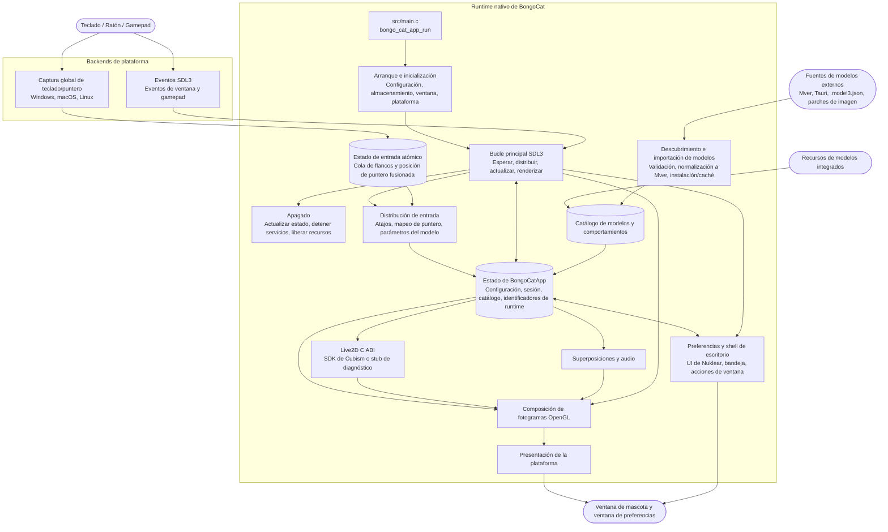

<div align="center">
  <a href="https://bongocat.pet" target="_blank">
    
  </a>
  <h1><a href="https://bongocat.pet" target="_blank">BongoCat</a></h1>
</div>

<p align="center">💘 C/C++ × SDL3 × OpenGL, mézclalo todo, ¡a tocar! ¡Bong~ Bongo Cat!!!</p>
<p align="center">
  Elige el idioma ❯ <a href="https://github.com/vladelaina/BongoCat/blob/main/README.md">English</a> • <a href="https://github.com/vladelaina/BongoCat/blob/main/docs/README.zh-CN.md">简体中文</a> • <a href="https://github.com/vladelaina/BongoCat/blob/main/docs/README.zh-Hant.md">繁體中文</a> • <a href="https://github.com/vladelaina/BongoCat/blob/main/docs/README.fr-FR.md">Français</a> • <a href="https://github.com/vladelaina/BongoCat/blob/main/docs/README.de-DE.md">Deutsch</a> • <a href="https://github.com/vladelaina/BongoCat/blob/main/docs/README.ja-JP.md">日本語</a> • <a href="https://github.com/vladelaina/BongoCat/blob/main/docs/README.ko-KR.md">한국어</a> • <a href="https://github.com/vladelaina/BongoCat/blob/main/docs/README.pt-BR.md">Português</a> • <a href="https://github.com/vladelaina/BongoCat/blob/main/docs/README.ru-RU.md">Русский</a> • <strong>Español</strong> • <a href="https://github.com/vladelaina/BongoCat/blob/main/docs/README.id-ID.md">Bahasa Indonesia</a>
</p>
<p align="center">
  <a href="https://github.com/vladelaina/BongoCat/blob/main/LICENSE"></a>
  <a href="https://github.com/vladelaina/BongoCat"></a>
  <a href="https://discord.gg/vf8jqnattk"></a>
  <a href="https://github.com/vladelaina/BongoCat/blob/main/docs/wechat.png"></a>
  <a href="https://qm.qq.com/q/cYlRBbvuda"></a>
</p>

<div align="center"><video src="https://github.com/user-attachments/assets/75719230-9e49-4124-ae5a-8e35592c5d49" autoplay loop style="border-radius: 8px; max-width: 800px;"></video></div>

> [!TIP]
> El modelo usado en la demo proviene de [宇痕冫](https://space.bilibili.com/348616056).
>
> 🎁 ¿Buscas modelos **gratuitos**? Trabajamos con creadores de modelos talentosos para ofrecerte una gran variedad de modelos gratuitos, ¡mientras seguimos explorando experiencias de escritorio aún más divertidas! Visita nuestro sitio web oficial: [bongocat.pet](https://bongocat.pet/models)

<p align="center">
  <a href="https://bongocat.pet/models">
    
  </a>
</p>

<p align="center"></p>

## 📥 Descarga

<a href="https://apps.microsoft.com/detail/9p41mlsx72xw?referrer=appbadge" target="_self"></a>

- GitHub Releases

  Descarga la última versión desde [GitHub Releases](https://github.com/vladelaina/BongoCat/releases/latest).

## 🛠️ Compilar desde el código fuente

BongoCat usa CMake y requiere un compilador C11, un compilador C++17, CMake 3.24 o superior y los archivos de desarrollo de OpenGL para escritorio. Por defecto, SDL3, yyjson, stb, miniaudio y Nuklear se descargan automáticamente durante la configuración, por lo que la primera configuración requiere conexión a internet.

Ejecuta los siguientes comandos en la raíz del proyecto (el directorio que contiene `CMakeLists.txt`).

### 📋 Requisitos por plataforma

- **Windows:** Visual Studio 2022 (con la carga de trabajo «Desarrollo para escritorio con C++») y CMake. Usa el generador MSVC; MinGW puede compilar el backend de diagnóstico, pero no es compatible con el SDK de Cubism.
- **macOS:** Xcode Command Line Tools, CMake y Ninja. Si la arquitectura de destino difiere de la predeterminada del host, especifícala mediante `CMAKE_OSX_ARCHITECTURES`.
- **Linux (Debian/Ubuntu):** GCC o Clang, Ninja y los encabezados de OpenGL/X11:

  ```bash
  sudo apt-get update
  sudo apt-get install -y build-essential cmake ninja-build \
    libgl1-mesa-dev libx11-dev libxi-dev libxfixes-dev libcurl4-openssl-dev
  ```

### 🔧 Configuración y compilación

En Linux y macOS, usa un generador de configuración única como Ninja:

```bash
cmake -S . -B build -G Ninja \
  -DCMAKE_BUILD_TYPE=Release \
  -DBONGO_CAT_FETCH_DEPS=ON
cmake --build build --parallel
```

En Windows, ejecuta los comandos desde el Símbolo del sistema para desarrolladores de Visual Studio 2022 (o cualquier shell donde MSVC esté disponible):

```powershell
cmake -S . -B build -G "Visual Studio 17 2022" -A x64 `
  -DBONGO_CAT_FETCH_DEPS=ON
cmake --build build --config Release --parallel
```

El ejecutable se encuentra en `build/BongoCat` en Linux, en `build/BongoCat.app/Contents/MacOS/BongoCat` en macOS y en `build/Release/BongoCat.exe` para las compilaciones de Visual Studio en Windows.

### 🧪 Pruebas

Los objetivos de CTest están habilitados por defecto. Ejecuta lo siguiente después de compilar:

```bash
ctest --test-dir build --output-on-failure
```

Para un generador de múltiples configuraciones como Visual Studio, especifica explícitamente la configuración de compilación:

```powershell
ctest --test-dir build -C Release --output-on-failure
```

### 🎭 Live2D / SDK de Cubism (opcional)

Si no se encuentra el SDK de Cubism, CMake muestra una advertencia y compila el backend de diagnóstico. Este backend está pensado para el arranque y el diagnóstico de plataforma; no proporciona renderizado de modelos Live2D. Para compilar el runtime completo, instala una versión compatible del Cubism SDK for Native, colócalo en `vendor/CubismSdkForNative` o indica explícitamente su ruta:

```bash
cmake -S . -B build -G Ninja \
  -DCMAKE_BUILD_TYPE=Release \
  -DBONGO_CAT_CUBISM_SDK=/path/to/CubismSdkForNative \
  -DBONGO_CAT_REQUIRE_CUBISM=ON
```

El SDK debe incluir la biblioteca Core, el código fuente de Framework y el directorio de terceros de OpenGL GLEW en la estructura esperada por `cmake/Cubism.cmake`. Las compilaciones de Cubism en Windows requieren Visual Studio 2022. Con `BONGO_CAT_REQUIRE_CUBISM=ON`, la configuración falla si el SDK no está disponible, en lugar de seleccionar silenciosamente el backend de diagnóstico.

### ⚙️ Opciones de CMake

| Opción | Valor por defecto | Descripción |
| --- | --- | --- |
| `BONGO_CAT_FETCH_DEPS` | `ON` | Descarga dependencias de terceros en versiones fijadas mediante `FetchContent` de CMake. Establécelo en `OFF` solo si SDL3, yyjson, stb, miniaudio y Nuklear ya están disponibles para CMake. |
| `BONGO_CAT_CUBISM_SDK` | `vendor/CubismSdkForNative` | Ruta del Cubism SDK for Native. |
| `BONGO_CAT_REQUIRE_CUBISM` | `OFF` | Hace fallar la configuración cuando no hay SDK disponible. |
| `BONGO_CAT_WARNINGS_AS_ERRORS` | `OFF` | Trata las advertencias del compilador nativo como errores. |

Para una compilación sin conexión, establece `BONGO_CAT_FETCH_DEPS=OFF` y proporciona las configuraciones de paquetes de CMake para SDL3 (incluido `SDL3-static`) y yyjson; si stb, Nuklear y miniaudio no se pueden detectar automáticamente, indica también sus directorios de inclusión:

```bash
cmake -S . -B build -G Ninja \
  -DCMAKE_BUILD_TYPE=Release \
  -DBONGO_CAT_FETCH_DEPS=OFF \
  -DBONGO_CAT_STB_INCLUDE_DIR=/path/to/stb \
  -DBONGO_CAT_NUKLEAR_INCLUDE_DIR=/path/to/nuklear \
  -DBONGO_CAT_MINIAUDIO_INCLUDE_DIR=/path/to/miniaudio
```

## 📌 Estado del proyecto


## 📜 Licencia

El código fuente y el runtime nativo de BongoCat están bajo la licencia [AGPL-3.0-only](../LICENSE).

El modo de modelo integrado por defecto (`standard`) permanece bajo la licencia MIT. Los recursos de modelo incluidos en `resources/assets/models/standard`, `keyboard` y `gamepad` están cubiertos por la [declaración de licencia MIT](../LICENSE-MIT) independiente. Esta licencia MIT se aplica únicamente a los recursos de los modelos y sus ilustraciones asociadas; no cambia la licencia del código fuente ni del runtime nativo de BongoCat.

## 🧭 Arquitectura técnica

La versión nativa actual se basa en C/C++, SDL3 y OpenGL. El siguiente diagrama destaca el flujo de datos en tiempo de ejecución; consulta los archivos de CMake para los detalles de compilación y empaquetado.

### 🔄 Propiedad del runtime y planificación de fotogramas

Cada proceso posee una instancia de `BongoCatApp` y un bucle de eventos/renderizado en el hilo principal. Los listeners de plataforma se detienen en el límite de entrada:

```text
Listeners de plataforma (teclado/ puntero)
            |
            v
  Estado de entrada C11 (cola atómica de flancos + posición de puntero fusionada)
            |
            v
  aplicación en el hilo principal <----- eventos SDL3
            |
            v
  parámetros del modelo, superposiciones y estado de la interfaz
            |
            v
  actualización del modelo -> composición OpenGL -> presentación de la plataforma
```

Los hooks de bajo nivel de Windows, el tap de eventos Quartz de macOS y los listeners XInput2 de Linux se ejecutan fuera del bucle principal. Publican pulsaciones de teclas y flancos de botones del ratón con marca de tiempo en una cola atómica acotada, y publican las coordenadas del puntero a través de una ranura de fusión independiente; tras una publicación correcta, se impulsa un evento de activación SDL nativo, lo que evita que los eventos de movimiento de alta frecuencia desplacen los flancos ordenados de teclas y botones. En Windows, DirectInput solo se usa a través de la interfaz de puntero de la plataforma cuando el modelo solicita movimiento relativo. Los eventos de ventana, preferencias y gamepad de SDL3 se procesan en el hilo principal; los eventos de gamepad se normalizan antes de pasarse a los parámetros del modelo o a los atajos. Ningún listener de plataforma llama directamente al código de Live2D, superposiciones o interfaz.

`bongo_cat_app_run` gestiona los parámetros de actualización, cierre y procesos secundarios, hace cumplir la propiedad de una única instancia del proceso principal, asigna el estado de la aplicación, realiza la inicialización, entra en `bongo_cat_app_loop` y luego actualiza el estado y libera los recursos en el orden definido. La inicialización carga la configuración y las rutas de almacenamiento, localiza los recursos, crea la ventana de mascota SDL/OpenGL, inicializa los backends de plataforma, crea los servicios de Live2D/superposiciones/audio, escanea las fuentes de modelos integrados/instalados/cercanos y carga los modelos disponibles. `BongoCatApp` conserva la configuración, el estado de la sesión, los catálogos de modelos y comportamientos, los identificadores de plataforma y los identificadores de servicios en tiempo de ejecución.

Los paquetes de modelos instalados usan Mver como formato canónico. El proceso de importación analiza el archivo o directorio seleccionado, descubre y valida los candidatos, genera una huella de identidad del paquete, convierte las fuentes Tauri a Mver, aplica parches de imagen y envía el paquete normalizado a `models_root`. Después se generan los adaptadores de tiempo de ejecución y se actualiza el catálogo. Las fuentes cercanas solo se descubren sin instalar su árbol de origen; sus adaptadores y resultados de comprobación se almacenan en caché bajo `cache_root`, fuera de `models_root`.

Cada iteración del bucle principal espera activaciones SDL/nativas o el vencimiento más temprano de los plazos de fotograma, interfaz, animación y acierto de puntero (máximo 250 ms). El bucle distribuye los eventos SDL en cola, vacía la cola de entrada atómica y realiza la recuperación de liberaciones, actualiza el estado de la ventana y de actualización del modelo y luego aplica los parámetros de entrada. Con Cubism habilitado, el plazo del modelo sigue `settings.model.max_fps` (predeterminado 60 FPS); las compilaciones de diagnóstico usan un intervalo de reserva de 100 ms. El tiempo transcurrido del modelo se cuenta como máximo 250 ms y se divide en hasta ocho subpasos, cada uno con un objetivo de no más de 1/30 de segundo.

La ruta normal de la mascota solo se renderiza cuando la ventana es visible, no está minimizada y está marcada como sucia. Cada fotograma primero limpia el fondo, dibuja el modelo y luego compone las superposiciones de puntero, teclas y efectos, y finalmente llama al presentador de la plataforma. Las operaciones de vista previa pueden solicitar renderizado inmediato; el renderizado de capturas de pantalla puede omitir la presentación. macOS y Linux intercambian directamente la ventana SDL OpenGL; Windows la intercambia directamente cuando la presentación en capas no está habilitada; de lo contrario, lee el búfer de fotogramas y llama a `UpdateLayeredWindow`. La interfaz de preferencias tiene su propia ventana SDL/OpenGL y se renderiza y presenta por separado.

El runtime C llama a la ABI declarada en `include/bongo_cat/model.h`. El puente Live2D y la implementación de Cubism están en `src/live2d` y solo usan C++17 cuando el SDK de Cubism está habilitado; el resto del runtime nativo usa C11. Los tipos de Cubism se mantienen detrás de identificadores C opacos; cuando el SDK no está disponible, `src/live2d/live2d_stub.c` proporciona el backend de diagnóstico.



## ❓ Preguntas frecuentes

### 🔒 ¿BongoCat registra mis entradas de teclado o ratón?

No. BongoCat procesa las entradas de teclado y ratón localmente para impulsar animaciones y atajos. No registra ni sube pulsaciones de teclas, acciones del ratón ni otros datos de interacción. La configuración también se guarda solo localmente; la aplicación no incluye anuncios, herramientas de análisis ni código de seguimiento de usuarios. Al comprobar actualizaciones solo se solicitan los metadatos públicos de versión; no se envían datos de entrada, configuración ni uso.

### 🖼️ ¿Por qué OpenGL y no Vulkan?

No porque Vulkan sea malo, sino porque BongoCat no necesita ese nivel de complejidad. La aplicación renderiza principalmente un modelo Live2D, algunas capas de interfaz y una ventana de escritorio transparente; OpenGL lo cubre con facilidad y se integra de forma natural con SDL3 y el renderizador OpenGL de Cubism. Migrar a Vulkan implicaría mantener más código de renderizado y sincronización en tres plataformas de escritorio, sin un beneficio notable para el usuario. Para la carga de trabajo actual de BongoCat, OpenGL hace que el renderizador sea más ligero, más fácil de depurar y mantener, y sigue ofreciendo el rendimiento necesario.

## 🙏 Agradecimientos especiales
> [!TIP]
> Cada paso de BongoCat está impulsado por el espíritu del código abierto. Agradecemos sinceramente a todos los colaboradores de la comunidad por sus contribuciones desinteresadas (listadas a continuación en orden cronológico). Es vuestro apoyo lo que hace que la compañía en el escritorio sea más libre y genuina.❤️‍🔥


<a href="https://bongocat.pet">
    
</a>


[linux.do](https://linux.do/t/topic/2845597)
---

<div align="center">
Derechos de autor © 2026 - **BongoCat**<br>
By vladelaina<br>
Made with ❤️ & ⌨️
</div>
