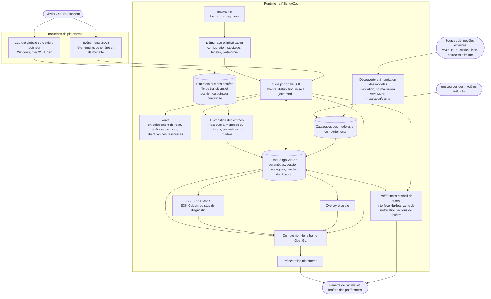

<div align="center">
  <a href="https://bongocat.pet" target="_blank">
    
  </a>

  <h1>
    <a href="https://bongocat.pet" target="_blank" style="text-decoration: none; color: inherit;">BongoCat</a>
  </h1>
</div>

<!-- Description du projet + icône fusée -->
<p align="center">
 💘C/C++ × SDL3 × OpenGL, mélangez le tout, assemblez-le ! Bong~ Bongo Cat !!!
</p>
<p align="center">
<a href="https://github.com/vladelaina/BongoCat/blob/main/README.md">English</a> • <a href="https://github.com/vladelaina/BongoCat/blob/main/docs/README.zh-CN.md">简体中文</a> • <a href="https://github.com/vladelaina/BongoCat/blob/main/docs/README.zh-Hant.md">繁體中文</a> • <a href="https://github.com/vladelaina/BongoCat/blob/main/docs/README.fr-FR.md"><strong>Français</strong></a> • <a href="https://github.com/vladelaina/BongoCat/blob/main/docs/README.de-DE.md">Deutsch</a> • <a href="https://github.com/vladelaina/BongoCat/blob/main/docs/README.ja-JP.md">日本語</a> • <a href="https://github.com/vladelaina/BongoCat/blob/main/docs/README.ko-KR.md">한국어</a> • <a href="https://github.com/vladelaina/BongoCat/blob/main/docs/README.pt-BR.md">Português</a> • <a href="https://github.com/vladelaina/BongoCat/blob/main/docs/README.ru-RU.md">Русский</a> • <a href="https://github.com/vladelaina/BongoCat/blob/main/docs/README.es-ES.md">Español</a> • <a href="https://github.com/vladelaina/BongoCat/blob/main/docs/README.id-ID.md">Bahasa Indonesia</a>
</p>
<p align="center">
  <a href="https://github.com/vladelaina/BongoCat/blob/main/LICENSE"></a>
  <a href="https://github.com/vladelaina/BongoCat"></a>
  <a href="https://discord.gg/vf8jqnattk"></a>
  <a href="https://github.com/vladelaina/BongoCat/blob/main/docs/wechat.png"></a>
  <a href="https://qm.qq.com/q/cYlRBbvuda"></a>
</p>

<!-- Vidéo de démonstration -->
<div align="center" style="margin-bottom: 30px;">
  <video src="https://github.com/user-attachments/assets/75719230-9e49-4124-ae5a-8e35592c5d49
" autoplay loop style="border-radius: 8px; max-width: 800px;"></video>
</div>


> [!TIP]
> Le modèle présenté dans cette démonstration provient de [宇痕冫](https://space.bilibili.com/348616056).
>
> 🎁 Vous cherchez des modèles **gratuits** ? Nous collaborons avec des créateurs de modèles talentueux pour vous proposer une grande variété de modèles gratuits, tout en explorant continuellement de nouvelles expériences de bureau amusantes ! Rendez-vous sur notre site officiel : [bongocat.pet](https://bongocat.pet/models)


<p align="center">
  <a href="https://bongocat.pet/models">
    
  </a>
</p>

<p align="center">
    
  </p>

## 📥 Téléchargement

<a href="https://apps.microsoft.com/detail/9p41mlsx72xw?referrer=appbadge" target="_self" >
	
</a>

- GitHub Releases

  Téléchargez la dernière version depuis [GitHub Releases](https://github.com/vladelaina/BongoCat/releases/latest).

## 🛠️ Compilation depuis les sources

BongoCat utilise CMake et nécessite un compilateur C11, un compilateur C++17,
CMake 3.24 ou une version plus récente, ainsi que les fichiers de développement
OpenGL pour environnement de bureau. SDL3, yyjson, stb, miniaudio et Nuklear
sont téléchargés par défaut lors de la configuration ; la première configuration
nécessite donc un accès au réseau.

Exécutez les commandes ci-dessous depuis la racine du projet (le répertoire
contenant `CMakeLists.txt`).

### 📋 Prérequis par plateforme

- **Windows :** Visual Studio 2022 avec la charge de travail Desktop C++ et CMake.
  Utilisez le générateur MSVC ; MinGW peut compiler le backend de diagnostic,
  mais il n'est pas pris en charge par le SDK Cubism.
- **macOS :** Xcode Command Line Tools, CMake et Ninja. Définissez une architecture
  avec `CMAKE_OSX_ARCHITECTURES` lorsqu'elle diffère de l'architecture par défaut
  de la machine hôte.
- **Linux (Debian/Ubuntu) :** GCC ou Clang, Ninja ainsi que les en-têtes OpenGL/X11 :
  ```bash
  sudo apt-get update
  sudo apt-get install -y build-essential cmake ninja-build \
    libgl1-mesa-dev libx11-dev libxi-dev libxfixes-dev libcurl4-openssl-dev
  ```

### 🔧 Configuration et compilation

Sous Linux et macOS, utilisez un générateur à configuration unique tel que Ninja :

```bash
cmake -S . -B build -G Ninja \
  -DCMAKE_BUILD_TYPE=Release \
  -DBONGO_CAT_FETCH_DEPS=ON
cmake --build build --parallel
```

Sous Windows, exécutez les commandes depuis un shell de développement
Visual Studio 2022 (ou un autre shell dans lequel MSVC est disponible) :

```powershell
cmake -S . -B build -G "Visual Studio 17 2022" -A x64 `
  -DBONGO_CAT_FETCH_DEPS=ON
cmake --build build --config Release --parallel
```

L'exécutable est généré dans `build/BongoCat` sous Linux,
dans `build/BongoCat.app/Contents/MacOS/BongoCat` sous macOS,
et dans `build/Release/BongoCat.exe` pour les compilations Visual Studio.

### 🧪 Tests

Les cibles CTest sont activées par défaut. Exécutez-les après la compilation :

```bash
ctest --test-dir build --output-on-failure
```

Pour un générateur multi-configuration tel que Visual Studio,
sélectionnez explicitement la configuration de compilation :

```powershell
ctest --test-dir build -C Release --output-on-failure
```

### 🎭 Live2D / SDK Cubism (facultatif)

Si le SDK Cubism n'est pas présent, CMake affiche un avertissement et compile
le backend de diagnostic. Ce backend est destiné au démarrage et aux diagnostics
de plateforme ; il ne permet pas le rendu des modèles Live2D. Pour compiler
le runtime complet, installez une version compatible du Cubism SDK for Native
et placez-la dans `vendor/CubismSdkForNative`, ou indiquez explicitement son
emplacement :

```bash
cmake -S . -B build -G Ninja \
  -DCMAKE_BUILD_TYPE=Release \
  -DBONGO_CAT_CUBISM_SDK=/path/to/CubismSdkForNative \
  -DBONGO_CAT_REQUIRE_CUBISM=ON
```

Le SDK doit contenir sa bibliothèque Core, les sources du Framework ainsi que
l'arborescence tierce OpenGL GLEW dans la structure attendue par
`cmake/Cubism.cmake`. Les compilations Cubism sous Windows nécessitent
Visual Studio 2022. `BONGO_CAT_REQUIRE_CUBISM=ON` fait échouer la configuration
au lieu de sélectionner silencieusement le backend de diagnostic.

### ⚙️ Options CMake

| Option | Valeur par défaut | Description |
| --- | --- | --- |
| `BONGO_CAT_FETCH_DEPS` | `ON` | Télécharge les dépendances tierces aux versions épinglées via `FetchContent` de CMake. Définissez cette option sur `OFF` uniquement si SDL3, yyjson, stb, miniaudio et Nuklear sont déjà accessibles à CMake. |
| `BONGO_CAT_CUBISM_SDK` | `vendor/CubismSdkForNative` | Chemin vers le Cubism SDK for Native. |
| `BONGO_CAT_REQUIRE_CUBISM` | `OFF` | Fait échouer la configuration lorsqu'aucun SDK Cubism utilisable n'est disponible. |
| `BONGO_CAT_WARNINGS_AS_ERRORS` | `OFF` | Traite les avertissements du compilateur natif comme des erreurs. |

Pour une compilation hors ligne avec `BONGO_CAT_FETCH_DEPS=OFF`, fournissez
les configurations de paquets CMake pour SDL3 (y compris `SDL3-static`) et yyjson,
ainsi que les répertoires d'inclusion de stb, Nuklear et miniaudio lorsqu'ils ne
peuvent pas être détectés automatiquement :

```bash
cmake -S . -B build -G Ninja \
  -DCMAKE_BUILD_TYPE=Release \
  -DBONGO_CAT_FETCH_DEPS=OFF \
  -DBONGO_CAT_STB_INCLUDE_DIR=/path/to/stb \
  -DBONGO_CAT_NUKLEAR_INCLUDE_DIR=/path/to/nuklear \
  -DBONGO_CAT_MINIAUDIO_INCLUDE_DIR=/path/to/miniaudio
```

## 📌 État du projet


## 📜 Licence

Le code source et le runtime natif de BongoCat sont distribués sous licence
[AGPL-3.0-only](LICENSE).

Le mode de modèle intégré par défaut (`standard`) reste sous licence MIT.
Les ressources de modèles fournies dans `resources/assets/models/standard`,
`keyboard` et `gamepad` sont couvertes par la [licence MIT distincte](LICENSE-MIT).
Cette licence MIT s'applique uniquement aux ressources des modèles et aux
éléments graphiques qui les accompagnent ; elle ne modifie pas la licence du
code source ni du runtime natif de BongoCat.

## 🧭 Architecture technique

> La version native actuelle repose sur C/C++, SDL3 et OpenGL. Le diagramme ci-dessous se concentre sur le flux de données à l'exécution ; les détails de compilation et de packaging sont gérés par CMake.

### 🔄 Gestion du runtime et ordonnancement des frames

Chaque processus possède une instance de `BongoCatApp` ainsi qu'une boucle
principale d'événements et de rendu exécutée sur le thread principal.
Les écouteurs propres à chaque plateforme s'arrêtent à la frontière du
système d'entrée :

```text
Écouteurs de plateforme
(clavier / pointeur)
            |
            v
  État des entrées C11
  (file atomique de transitions + position du pointeur coalescée)
            |
            v
  application sur le thread principal <----- événements SDL3
            |
            v
  paramètres du modèle, overlay et état de l'interface
            |
            v
  mise à jour du modèle -> composition OpenGL -> présentation plateforme
```

Les hooks de bas niveau de Windows, l'event tap Quartz de macOS et l'écouteur
XInput2 de Linux s'exécutent en dehors de la boucle principale. Ils publient
les transitions horodatées des touches et des boutons de souris dans une file
atomique bornée, tandis que les coordonnées du pointeur sont publiées dans un
emplacement séparé utilisant la coalescence ; lorsqu'une publication réussit,
un événement SDL natif de réveil est envoyé. Cela empêche les mouvements à
haute fréquence d'évincer les transitions ordonnées des touches et des boutons.
Sous Windows, DirectInput est uniquement utilisé via l'interface de pointeur
propre à la plateforme lorsqu'un modèle demande un déplacement relatif.

Les événements SDL3 liés aux fenêtres, aux préférences et aux manettes sont
traités sur le thread principal, où les événements de manette sont normalisés
avant d'atteindre les paramètres du modèle ou les raccourcis. Aucun écouteur
de plateforme n'appelle directement le code Live2D, celui de l'overlay ou
celui de l'interface utilisateur.

`bongo_cat_app_run` gère l'arrêt lié aux mises à jour ainsi que les arguments
des processus secondaires, impose une instance unique pour le processus
principal, alloue l'état de l'application, exécute l'initialisation, entre dans
`bongo_cat_app_loop`, puis enregistre l'état et libère les ressources dans un
ordre défini.

L'initialisation charge la configuration et les chemins de stockage, localise
les ressources, crée la fenêtre SDL/OpenGL de l'animal de compagnie, initialise
le backend de la plateforme, crée les services Live2D, d'overlay et audio,
analyse les sources de modèles intégrées, installées ou locales, puis charge
un modèle utilisable. `BongoCatApp` possède les paramètres, l'état de session,
les catalogues de modèles et de comportements, les handles de plateforme ainsi
que les handles des services d'exécution.

Les paquets de modèles installés utilisent Mver comme format canonique.
Le processus d'importation résout le fichier ou le répertoire sélectionné,
découvre et valide les candidats, calcule l'empreinte d'identité du paquet,
convertit les sources Tauri vers Mver, applique les correctifs d'image et
enregistre le paquet normalisé sous `models_root`. Il génère ensuite
l'adaptateur d'exécution et actualise les catalogues.

Les sources locales voisines sont découvertes sans installer leur arborescence
source ; leurs adaptateurs et résultats d'inspection sont mis en cache en dehors
de `models_root`, sous `cache_root`.

À chaque itération de la boucle principale, l'application attend un réveil
SDL/natif ou la première échéance en attente concernant une frame, l'interface
utilisateur, une animation ou la détection du pointeur, avec un temps d'attente
maximal de 250 ms. Elle distribue ensuite les événements SDL en attente, vide
la file atomique des entrées et traite la récupération des relâchements, met à
jour l'état de la fenêtre et du rafraîchissement des modèles, puis applique les
paramètres dérivés des entrées.

Lorsque Cubism est activé, l'échéance de mise à jour du modèle suit
`settings.model.max_fps` (60 FPS par défaut) ; les compilations de diagnostic
utilisent un intervalle de secours de 100 ms. Le temps écoulé du modèle est
plafonné à 250 ms et divisé en un maximum de huit sous-étapes, avec pour
objectif de ne pas dépasser 1/30 s par sous-étape.

Dans le fonctionnement normal de l'animal de compagnie, le rendu n'est effectué
que lorsque la fenêtre est visible, non réduite et marquée comme nécessitant
un rafraîchissement. Une frame efface l'arrière-plan, dessine le modèle et
compose les overlays du pointeur, des touches et des effets avant d'appeler
le système de présentation de la plateforme.

Les opérations d'aperçu peuvent demander un rendu immédiat, tandis que les
rendus destinés à une capture peuvent ignorer la présentation. macOS et Linux
effectuent directement le swap de la fenêtre OpenGL SDL. Windows effectue
également directement le swap lorsque la présentation en couches est inactive ;
dans le cas contraire, la frame est relue pour `UpdateLayeredWindow`.

L'interface des préférences possède une fenêtre SDL/OpenGL distincte, rendue et
présentée indépendamment de la fenêtre de l'animal de compagnie.

Le runtime C appelle l'ABI déclarée dans `include/bongo_cat/model.h`.
Le pont Live2D et l'implémentation Cubism se trouvent dans `src/live2d` et
n'utilisent C++17 que lorsque le SDK Cubism est activé ; le reste du runtime
natif utilise C11. Les types Cubism restent masqués derrière des handles C
opaques, tandis que `src/live2d/live2d_stub.c` fournit le backend de diagnostic
lorsque le SDK n'est pas disponible.



## ❓ FAQ

### 🔒 BongoCat enregistre-t-il les entrées de mon clavier ou de ma souris ?

Non. BongoCat traite localement les entrées du clavier et de la souris afin de
piloter les animations et les raccourcis. Il n'enregistre ni ne téléverse vos
frappes au clavier, vos actions de souris ou toute autre donnée d'interaction.

La configuration est également stockée localement, et l'application ne contient
ni publicité, ni outil d'analyse, ni code de suivi des utilisateurs. Lorsqu'une
vérification de mise à jour est effectuée, l'application demande uniquement les
métadonnées publiques des versions ; elle n'envoie aucune donnée d'entrée,
de configuration ou d'utilisation.

### 🖼️ Pourquoi OpenGL plutôt que Vulkan ?

Nous avons choisi OpenGL non pas parce que Vulkan serait mauvais, mais parce que
BongoCat n'a tout simplement pas besoin de ce niveau de complexité.
L'application affiche principalement un modèle Live2D, quelques couches
d'interface et une fenêtre de bureau transparente. OpenGL prend déjà très bien
en charge cette charge de travail et s'intègre naturellement à SDL3 ainsi qu'au
renderer OpenGL de Cubism.

Passer à Vulkan impliquerait de maintenir beaucoup plus de code de rendu et de
synchronisation sur trois plateformes de bureau, sans amélioration perceptible
pour les utilisateurs. Pour la charge de travail actuelle de BongoCat, OpenGL
permet de conserver un renderer plus compact, plus simple à déboguer et plus
facile à maintenir, tout en fournissant les performances dont nous avons besoin.

## État du projet


## 🙏 Remerciements
> [!TIP]
> Chaque pas de BongoCat est porté par l'esprit de l'open source. Nous remercions sincèrement tous les contributeurs de la communauté pour leurs contributions désintéressées (listées ci-dessous par ordre chronologique de contribution). C'est votre soutien qui rend l'accompagnement sur le bureau plus libre et plus authentique.❤️‍🔥


<a href="https://bongocat.pet">
    
</a>


[linux.do](https://linux.do/t/topic/2845597)
---

<div align="center">

Copyright © 2026 - **BongoCat**\
Par vladelaina\
Fait avec ❤️ & ⌨️

</div>
