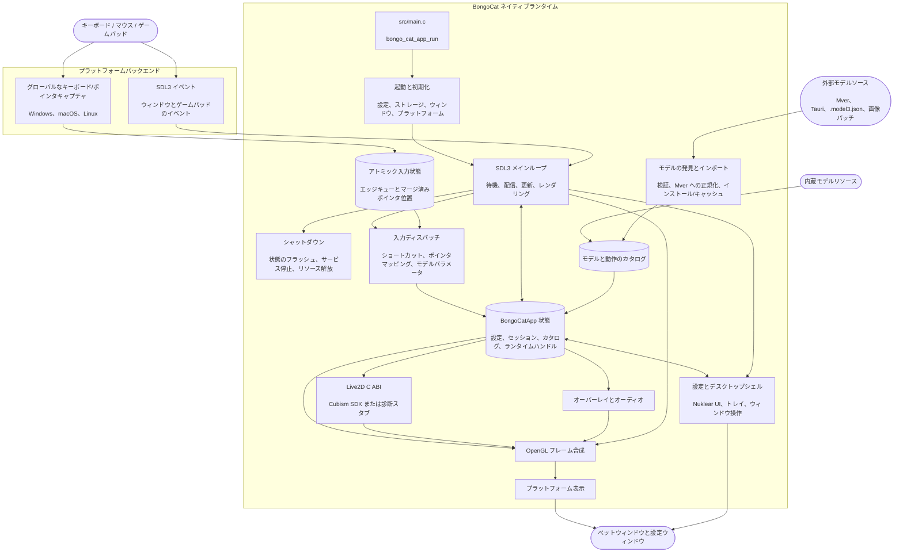

# 💘 C/C++ × SDL3 × OpenGL を混ぜて、思う存分叩け！Bong~ Bongo Cat!!!

言語を選択 ❯ English • 简体中文 • 繁體中文 • Français • Deutsch • 日本語 • 한국어 • Português • Русский • Español • [Bahasa Indonesia](README.id-ID.md)

<p align="center">
  <a href="https://github.com/vladelaina/BongoCat/blob/main/LICENSE"></a>
  <a href="https://github.com/vladelaina/BongoCat"></a>
  <a href="https://discord.gg/vf8jqnattk"></a>
  <a href="https://github.com/vladelaina/BongoCat/blob/main/docs/wechat.png"></a>
  <a href="https://qm.qq.com/q/cYlRBbvuda"></a>
</p>

> [!TIP]
> デモで使用されているモデルは [宇痕冫](https://space.bilibili.com/348616056) から提供されています。
>
> 🎁 **無料**のモデルをお探しですか？私たちは才能あるモデルクリエイターと協力して、多彩な無料モデルをお届けするとともに、楽しいデスクトップ体験を継続的に探求しています！公式サイトをご覧ください：[bongocat.pet](https://bongocat.pet/models)

<p align="center">
  <a href="https://bongocat.pet/models">
    
  </a>
</p>

## 📥 ダウンロード

[GitHub Releases](https://github.com/vladelaina/BongoCat/releases/latest) から最新バージョンをダウンロードしてください。

## 🛠️ ソースからのビルド

BongoCat は CMake を使用しており、C11 コンパイラ、C++17 コンパイラ、CMake 3.24 以降、およびデスクトップ用 OpenGL 開発ファイルが必要です。デフォルトでは SDL3、yyjson、stb、miniaudio、Nuklear が構成フェーズで自動的にダウンロードされるため、初回の構成にはインターネット接続が必要です。

プロジェクトのルートディレクトリ（`CMakeLists.txt` を含むディレクトリ）で以下のコマンドを実行してください。

### 📋 プラットフォーム別の前提条件

- **Windows:** Visual Studio 2022（「C++ によるデスクトップ開発」ワークロードをインストール）と CMake。MSVC ジェネレータを使用してください。MinGW では診断バックエンドをビルドできますが、Cubism SDK には対応していません。
- **macOS:** Xcode Command Line Tools、CMake、Ninja。対象アーキテクチャがホストのデフォルトと異なる場合は、`CMAKE_OSX_ARCHITECTURES` で指定してください。
- **Linux（Debian/Ubuntu）:** GCC または Clang、Ninja、および OpenGL/X11 ヘッダー：

```bash
sudo apt-get update
sudo apt-get install -y build-essential cmake ninja-build \
    libgl1-mesa-dev libx11-dev libxi-dev libxfixes-dev libcurl4-openssl-dev
```

### 🔧 設定とビルド

Linux と macOS では、Ninja のような単一構成ジェネレータを使用してください：

```bash
cmake -S . -B build -G Ninja \
-DCMAKE_BUILD_TYPE=Release \
-DBONGO_CAT_FETCH_DEPS=ON
cmake --build build --parallel
```

Windows では、Visual Studio 2022 の開発者コマンドプロンプト（または MSVC が利用可能な他のコマンドライン）から実行してください：

```powershell
cmake -S . -B build -G "Visual Studio 17 2022" -A x64 `
-DBONGO_CAT_FETCH_DEPS=ON
cmake --build build --config Release --parallel
```

実行可能ファイルの場所：Linux では `build/BongoCat`、macOS では `build/BongoCat.app/Contents/MacOS/BongoCat`、Visual Studio ビルドの Windows では `build/Release/BongoCat.exe`。

### 🧪 テスト

CTest ターゲットはデフォルトで有効です。ビルド後に実行：

```bash
ctest --test-dir build --output-on-failure
```

Visual Studio のような複数構成ジェネレータの場合は、ビルド構成を明示的に指定してください：

```powershell
ctest --test-dir build -C Release --output-on-failure
```

### 🎭 Live2D / Cubism SDK（任意）

Cubism SDK が見つからない場合、CMake は警告を表示して診断バックエンドをビルドします。このバックエンドは起動およびプラットフォーム診断用であり、Live2D モデルのレンダリングは提供しません。完全なランタイムをビルドするには、互換性のある Cubism SDK for Native をインストールし、`vendor/CubismSdkForNative` に配置するか、パスを明示的に渡してください：

```bash
cmake -S . -B build -G Ninja \
-DCMAKE_BUILD_TYPE=Release \
-DBONGO_CAT_CUBISM_SDK=/path/to/CubismSdkForNative \
-DBONGO_CAT_REQUIRE_CUBISM=ON
```

SDK には Core ライブラリ、Framework ソース、および `cmake/Cubism.cmake` で要求されるレイアウトの OpenGL GLEW サードパーティディレクトリを含める必要があります。Windows の Cubism ビルドには Visual Studio 2022 が必要です。`BONGO_CAT_REQUIRE_CUBISM=ON` は、SDK が利用できない場合に診断バックエンドを静かに選択するのではなく、構成を失敗させます。

### ⚙️ CMake オプション

| オプション | デフォルト値 | 説明 |
| --- | --- | --- |
| `BONGO_CAT_FETCH_DEPS` | `ON` | CMake `FetchContent` を使用して、固定バージョンのサードパーティ依存関係をダウンロードします。SDL3、yyjson、stb、miniaudio、Nuklear が CMake で利用可能な場合にのみ `OFF` に設定してください。 |
| `BONGO_CAT_CUBISM_SDK` | `vendor/CubismSdkForNative` | Cubism SDK for Native のパス。 |
| `BONGO_CAT_REQUIRE_CUBISM` | `OFF` | SDK が利用できない場合に構成を失敗させます。 |
| `BONGO_CAT_WARNINGS_AS_ERRORS` | `OFF` | ローカルコンパイラの警告をエラーとして扱います。 |

オフラインビルドでは `BONGO_CAT_FETCH_DEPS=OFF` を設定し、SDL3（`SDL3-static` を含む）と yyjson の CMake パッケージ設定を提供してください。stb、Nuklear、miniaudio を自動的に発見できない場合は、それらのインクルードディレクトリも提供してください：

```bash
cmake -S . -B build -G Ninja \
-DCMAKE_BUILD_TYPE=Release \
-DBONGO_CAT_FETCH_DEPS=OFF \
-DBONGO_CAT_STB_INCLUDE_DIR=/path/to/stb \
-DBONGO_CAT_NUKLEAR_INCLUDE_DIR=/path/to/nuklear \
-DBONGO_CAT_MINIAUDIO_INCLUDE_DIR=/path/to/miniaudio
```

## 📌 プロジェクトの状態


## 📜 ライセンス

BongoCat のソースコードとローカルランタイムは [AGPL-3.0-only](../LICENSE) ライセンスです。

デフォルトの内蔵モデルモード（`standard`）は引き続き MIT ライセンスです。`resources/assets/models/standard`、`keyboard`、`gamepad` にバンドルされているモデルリソースは、別途の [MIT ライセンス宣言](../LICENSE-MIT) の対象です。この MIT ライセンスはモデルリソースおよびその付随するアートワークのみに適用され、BongoCat のソースコードやローカルランタイムのライセンスを変更するものではありません。

## 🧭 技術的なアーキテクチャ

現在のネイティブバージョンは C/C++、SDL3、OpenGL で構築されています。以下の図はランタイムのデータフローに重点を置いています。ビルドとパッケージングの詳細は CMake ファイルを参照してください。

### 🔄 ランタイムの所有権とフレームスケジューリング

各プロセスは 1 つの `BongoCatApp` と 1 つのメインスレッドのイベント/レンダリングループを所有します。プラットフォームリスナーは入力の境界で停止します：

```text
プラットフォームリスナー（キーボード/ポインタ）
|
v
C11 入力状態（アトミックなエッジキュー + マージ済みポインタ位置）
|
v
メインスレッドアプリ <----- SDL3 イベント
|
v
モデルパラメータ、オーバーレイ、UI 状態
|
v
モデル更新 -> OpenGL 合成 -> プラットフォーム表示
```

Windows の低レベルフック、macOS の Quartz イベントタップ、Linux の XInput2 リスナーはメインループの外で動作します。これらはタイムスタンプ付きのキーとマウスボタンのエッジを有界アトミックキューに公開し、別個のマージスロットを介してポインタ座標を公開します。公開に成功するとネイティブの SDL ウェイクアップイベントをプッシュし、高頻度の移動イベントが順序付けられたキーおよびボタンのエッジを押し出すのを防ぎます。Windows では、モデルが相対移動を要求した場合にのみ、プラットフォームポインタインターフェースを介して DirectInput が使用されます。SDL3 のウィンドウ、設定、ゲームパッドイベントはメインスレッドで処理され、ゲームパッドイベントはモデルパラメータまたはショートカットに渡す前に正規化されます。どのプラットフォームリスナーも Live2D、オーバーレイ、UI コードを直接呼び出すことはありません。

`bongo_cat_app_run` は更新、シャットダウン、サブプロセスパラメータを処理し、メインプロセスのシングルインスタンス所有権を確保し、アプリ状態を割り当て、初期化を実行し、`bongo_cat_app_loop` に入り、その後定義された順序で状態をフラッシュしてリソースを破棄します。初期化は設定とストレージパスを読み込み、リソースを探し、SDL/OpenGL のペットウィンドウを作成し、プラットフォームバックエンドを初期化し、Live2D/オーバーレイ/オーディオサービスを作成し、内蔵/インストール済み/近傍のモデルソースをスキャンして、利用可能なモデルを読み込みます。`BongoCatApp` は設定、セッション状態、モデルと動作のカタログ、プラットフォームハンドル、ランタイムサービスのハンドルを保持します。

インストール済みモデルパッケージは Mver を正規形式として使用します。インポートプロセスは選択したファイルまたはディレクトリを解析し、候補を発見して検証し、パッケージの同一性フィンガープリントを生成し、Tauri ソースを Mver に変換し、画像パッチを適用し、正規化されたパッケージを `models_root` にコミットします。その後、ランタイムアダプタを生成してカタログを更新します。近傍ソースはソースディレクトリをインストールせずにのみ発見されます。そのアダプタと検証結果は `models_root` の外にある `cache_root` にキャッシュされます。

各メインループの反復は、SDL/ネイティブのウェイクアップ、または最も早いフレーム、UI、アニメーション、ポインタヒットの期限（最大 250 ミリ秒）を待ちます。ループはキューに入れられた SDL イベントをディスパッチし、アトミックな入力キューを空にして解放/復元を実行し、ウィンドウとモデルの更新状態を更新してから、入力パラメータを適用します。Cubism が有効な場合、モデルの期限は `settings.model.max_fps`（デフォルト 60 FPS）に従います。診断ビルドでは 100 ミリ秒のフォールバック間隔を使用します。モデルの経過時間は最大 250 ミリ秒として扱われ、各サブステップの目標が 1/30 秒以下になるように、最大 8 つのサブステップに分割されます。

通常のペットパスは、ウィンドウが表示され、最小化されておらず、ダーティとマークされている場合にのみレンダリングされます。各フレームは最初に背景をクリアし、モデルを描画し、それからポインタ、キー、エフェクトのオーバーレイを合成し、最後にプラットフォームレンダラーを呼び出します。プレビュー操作は即時レンダリングを要求できます。スクリーンショットレンダリングは表示をスキップできます。macOS と Linux は SDL OpenGL ウィンドウを直接スワップします。Windows はレイヤードプレゼンテーションが有効でない場合は直接スワップし、有効な場合はフレームバッファを読み取って `UpdateLayeredWindow` を呼び出します。設定 UI は独立した SDL/OpenGL ウィンドウを持ち、個別にレンダリングおよび表示されます。

C ランタイムは `include/bongo_cat/model.h` で宣言された ABI を呼び出します。Live2D ブリッジと Cubism 実装は `src/live2d` にあり、Cubism SDK が有効な場合のみ C++17 を使用します。残りのネイティブランタイムは C11 を使用します。Cubism 型は不透明な C ハンドルの背後に保持されます。SDK が利用できない場合、`src/live2d/live2d_stub.c` が診断バックエンドを提供します。



## ❓ よくある質問

### 🔒 BongoCat は私のキーボードやマウスの入力を記録しますか？

いいえ。BongoCat はキーボードとマウスの入力をローカルで処理し、アニメーションとショートカットを駆動します。キーストローク、マウス操作、その他のインタラクションデータを記録またはアップロードすることはありません。設定もローカルにのみ保存され、アプリには広告、分析ツール、ユーザートラッキングコードは含まれていません。更新チェックを実行するときは公開されたバージョンメタデータのみを要求し、入力、設定、使用データを送信することはありません。

### 🖼️ なぜ Vulkan ではなく OpenGL を使うのですか？

これは Vulkan が良くないからではなく、BongoCat がそのレベルの複雑さを必要としないからです。このアプリは主に 1 つの Live2D モデル、少数の UI レイヤー、透明なデスクトップウィンドウをレンダリングします。OpenGL で十分にまかなえ、SDL3 および Cubism の OpenGL レンダラーとも自然に連携します。Vulkan への移行は 3 つのデスクトッププラットフォームでより多くのレンダリングと同期コードを維持する必要があり、ユーザーにとって明確な利点はありません。BongoCat の現在のワークロードでは、OpenGL によってレンダラーはより簡潔でデバッグ・保守が容易になり、必要なパフォーマンスを維持できます。

## 🙏 謝辞
> [!TIP]
> BongoCat の一歩一歩はオープンソースの精神に支えられています。コミュニティのコントリビューターの皆さんの無私の貢献に心より感謝します（貢献日の古い順に記載）。皆さんのご支援こそが、デスクトップでの伴走をより自由で温かいものにしています。❤️‍🔥


<a href="https://bongocat.pet">
    
</a>


[linux.do](https://linux.do/t/topic/2845597)
---

<div align="center">

Copyright © 2026 - **BongoCat**\
By vladelaina\
Made with ❤️ & ⌨️

</div>
