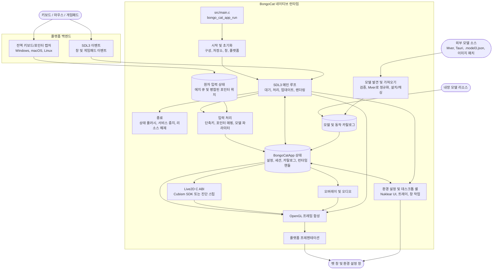

<div align="center">
  <a href="https://bongocat.pet" target="_blank">
    
  </a>
  <h1><a href="https://bongocat.pet" target="_blank">BongoCat</a></h1>
</div>

<p align="center">💘 C/C++ × SDL3 × OpenGL，함께 섞어서 마음껏 두드리세요! Bong~ Bongo Cat!!!</p>
<p align="center">
  언어 선택 ❯ <a href="https://github.com/vladelaina/BongoCat/blob/main/README.md">English</a> • <a href="https://github.com/vladelaina/BongoCat/blob/main/docs/README.zh-CN.md">简体中文</a> • <a href="https://github.com/vladelaina/BongoCat/blob/main/docs/README.zh-Hant.md">繁體中文</a> • <a href="https://github.com/vladelaina/BongoCat/blob/main/docs/README.fr-FR.md">Français</a> • <a href="https://github.com/vladelaina/BongoCat/blob/main/docs/README.de-DE.md">Deutsch</a> • <a href="https://github.com/vladelaina/BongoCat/blob/main/docs/README.ja-JP.md">日本語</a> • <strong>한국어</strong> • <a href="https://github.com/vladelaina/BongoCat/blob/main/docs/README.pt-BR.md">Português</a> • <a href="https://github.com/vladelaina/BongoCat/blob/main/docs/README.ru-RU.md">Русский</a> • <a href="https://github.com/vladelaina/BongoCat/blob/main/docs/README.es-ES.md">Español</a> • <a href="https://github.com/vladelaina/BongoCat/blob/main/docs/README.id-ID.md">Bahasa Indonesia</a>
</p>
<p align="center">
  <a href="https://github.com/vladelaina/BongoCat/blob/main/LICENSE"></a>
  <a href="https://github.com/vladelaina/BongoCat"></a>
  <a href="https://discord.gg/vf8jqnattk"></a>
  <a href="https://github.com/vladelaina/BongoCat/blob/main/docs/wechat.png"></a>
  <a href="https://qm.qq.com/q/cYlRBbvuda"></a>
</p>

<div align="center"><video src="https://github.com/user-attachments/assets/75719230-9e49-4124-ae5a-8e35592c5d49" autoplay loop style="border-radius: 8px; max-width: 800px;"></video></div>

> [!TIP]
> 데모에 사용된 모델은 [宇痕冫](https://space.bilibili.com/348616056)님의 작품입니다.
>
> 🎁 **무료** 모델을 찾으시나요? 저희는 재능 있는 모델 크리에이터들과 협력하여 다양한 무료 모델을 제공하고, 더 재미있는 데스크톱 경험도 끊임없이 탐색하고 있습니다! 공식 웹사이트를 방문하세요: [bongocat.pet](https://bongocat.pet/models)

<p align="center">
  <a href="https://bongocat.pet/models">
    
  </a>
</p>

<p align="center"></p>

## 📥 다운로드

<a href="https://apps.microsoft.com/detail/9p41mlsx72xw?referrer=appbadge" target="_self"></a>

- GitHub Releases

  [GitHub Releases](https://github.com/vladelaina/BongoCat/releases/latest)에서 최신 버전을 다운로드하세요.

## 🛠️ 소스 코드로 빌드하기

BongoCat은 CMake를 사용하며, C11 컴파일러, C++17 컴파일러, CMake 3.24 이상, 데스크톱 OpenGL 개발 파일이 필요합니다. 기본적으로 SDL3, yyjson, stb, miniaudio 및 Nuklear는 구성 단계에서 자동으로 다운로드되므로, 첫 구성 시 네트워크 연결이 필요합니다.

프로젝트 루트 디렉토리(`CMakeLists.txt`가 있는 디렉토리)에서 다음 명령어를 실행하세요.

### 📋 플랫폼 사전 요구 사항

- **Windows:** Visual Studio 2022("C++를 사용한 데스크톱 개발" 워크로드 설치) 및 CMake. MSVC 생성기를 사용하세요. MinGW는 진단 백엔드를 빌드할 수 있지만 Cubism SDK를 지원하지 않습니다.
- **macOS:** Xcode Command Line Tools, CMake 및 Ninja. 대상 아키텍처가 호스트 기본 아키텍처와 다른 경우 `CMAKE_OSX_ARCHITECTURES`를 통해 지정하세요.
- **Linux(Debian/Ubuntu):** GCC 또는 Clang, Ninja, OpenGL/X11 헤더 파일:

  ```bash
  sudo apt-get update
  sudo apt-get install -y build-essential cmake ninja-build \
    libgl1-mesa-dev libx11-dev libxi-dev libxfixes-dev libcurl4-openssl-dev
  ```

### 🔧 구성 및 빌드

Linux 및 macOS에서는 Ninja와 같은 단일 구성 생성기를 사용하세요:

```bash
cmake -S . -B build -G Ninja \
  -DCMAKE_BUILD_TYPE=Release \
  -DBONGO_CAT_FETCH_DEPS=ON
cmake --build build --parallel
```

Windows에서는 Visual Studio 2022 개발자 명령 프롬프트(또는 MSVC를 사용할 수 있는 기타 명령줄)에서 다음을 실행하세요:

```powershell
cmake -S . -B build -G "Visual Studio 17 2022" -A x64 `
  -DBONGO_CAT_FETCH_DEPS=ON
cmake --build build --config Release --parallel
```

실행 파일 위치: Linux `build/BongoCat`, macOS `build/BongoCat.app/Contents/MacOS/BongoCat`, Visual Studio 빌드 Windows 버전 `build/Release/BongoCat.exe`.

### 🧪 테스트

CTest 대상은 기본적으로 활성화됩니다. 빌드 후 실행:

```bash
ctest --test-dir build --output-on-failure
```

Visual Studio와 같은 다중 구성 생성기의 경우 빌드 구성을 명시적으로 지정하세요:

```powershell
ctest --test-dir build -C Release --output-on-failure
```

### 🎭 Live2D / Cubism SDK (선택 사항)

Cubism SDK를 찾을 수 없으면 CMake는 경고를 표시하고 진단 백엔드를 빌드합니다. 이 백엔드는 시작 및 플랫폼 진단에 사용되며 Live2D 모델 렌더링을 제공하지 않습니다. 전체 런타임을 빌드하려면 호환되는 Cubism SDK for Native를 설치하고 `vendor/CubismSdkForNative`에 배치하거나 경로를 명시적으로 전달하세요:

```bash
cmake -S . -B build -G Ninja \
  -DCMAKE_BUILD_TYPE=Release \
  -DBONGO_CAT_CUBISM_SDK=/path/to/CubismSdkForNative \
  -DBONGO_CAT_REQUIRE_CUBISM=ON
```

SDK에는 Core 라이브러리, Framework 소스 코드, 그리고 `cmake/Cubism.cmake`에서 요구하는 레이아웃의 OpenGL GLEW 서드파티 디렉토리가 포함되어야 합니다. Windows Cubism 빌드에는 Visual Studio 2022가 필요합니다. `BONGO_CAT_REQUIRE_CUBISM=ON`은 SDK를 사용할 수 없을 때 진단 백엔드를 자동으로 선택하는 대신 구성을 실패하게 합니다.

### ⚙️ CMake 옵션

| 옵션 | 기본값 | 설명 |
| --- | --- | --- |
| `BONGO_CAT_FETCH_DEPS` | `ON` | CMake `FetchContent`를 사용하여 고정 버전의 서드파티 종속성을 다운로드합니다. SDL3, yyjson, stb, miniaudio 및 Nuklear를 CMake에서 이미 사용할 수 있는 경우에만 `OFF`로 설정하세요. |
| `BONGO_CAT_CUBISM_SDK` | `vendor/CubismSdkForNative` | Cubism SDK for Native의 경로입니다. |
| `BONGO_CAT_REQUIRE_CUBISM` | `OFF` | SDK를 사용할 수 없을 때 구성을 실패하게 합니다. |
| `BONGO_CAT_WARNINGS_AS_ERRORS` | `OFF` | 로컬 컴파일러 경고를 오류로 처리합니다. |

오프라인 빌드 시 `BONGO_CAT_FETCH_DEPS=OFF`로 설정하고, SDL3(`SDL3-static` 포함) 및 yyjson의 CMake 패키지 구성을 제공하세요. stb, Nuklear 및 miniaudio를 자동으로 찾을 수 없는 경우 해당 include 디렉토리도 제공해야 합니다:

```bash
cmake -S . -B build -G Ninja \
  -DCMAKE_BUILD_TYPE=Release \
  -DBONGO_CAT_FETCH_DEPS=OFF \
  -DBONGO_CAT_STB_INCLUDE_DIR=/path/to/stb \
  -DBONGO_CAT_NUKLEAR_INCLUDE_DIR=/path/to/nuklear \
  -DBONGO_CAT_MINIAUDIO_INCLUDE_DIR=/path/to/miniaudio
```

## 📌 프로젝트 상태


## 📜 라이선스

BongoCat 소스 코드 및 로컬 런타임은 [AGPL-3.0-only](../LICENSE) 라이선스를 따릅니다.

기본 내장 모델(`standard`)은 여전히 MIT 라이선스를 따릅니다. `resources/assets/models/standard`, `keyboard` 및 `gamepad`에 번들로 제공되는 모델 리소스는 별도의 [MIT 라이선스 고지](../LICENSE-MIT)가 적용됩니다. 해당 MIT 라이선스는 모델 리소스 및 관련 아트워크에만 적용되며, BongoCat 소스 코드나 로컬 런타임의 라이선스를 변경하지 않습니다.

## 🧭 기술 아키텍처

현재 네이티브 버전은 C/C++, SDL3 및 OpenGL을 기반으로 구축되었습니다. 아래 다이어그램은 런타임 데이터 흐름을 중점적으로 보여줍니다. 빌드 및 패키징 세부 사항은 CMake 파일을 참조하세요.

### 🔄 런타임 소유권 및 프레임 스케줄링

각 프로세스는 하나의 `BongoCatApp`과 하나의 메인 스레드 이벤트/렌더링 루프를 소유합니다. 플랫폼 리스너는 입력 경계에서 중단됩니다:

```text
플랫폼 리스너 (키보드/포인터)
            |
            v
  C11 입력 상태 (원자적 에지 큐 + 병합된 포인터 위치)
            |
            v
  메인 스레드 애플리케이션 <----- SDL3 이벤트
            |
            v
  모델 파라미터, 오버레이 및 UI 상태
            |
            v
  모델 업데이트 -> OpenGL 합성 -> 플랫폼 프레젠테이션
```

Windows 로우 레벨 훅, macOS Quartz 이벤트 탭, Linux XInput2 리스너는 메인 루프 외부에서 실행됩니다. 이들은 타임스탬프가 찍힌 키 및 마우스 버튼 에지를 유계 원자 큐에 게시하고, 독립적인 병합 슬롯을 통해 포인터 좌표를 게시합니다. 성공적인 게시 후에는 네이티브 SDL 웨이크 이벤트를 푸시하여 높은 빈도의 이동 이벤트가 정렬된 키 및 버튼 에지를 밀어내는 것을 방지합니다. Windows에서는 모델이 상대 이동을 요청할 때만 플랫폼 포인터 인터페이스를 통해 DirectInput을 사용합니다. SDL3 창, 환경 설정 및 게임패드 이벤트는 메인 스레드에서 처리되며, 게임패드 이벤트는 모델 파라미터나 단축키에 전달되기 전에 정규화됩니다. 어떤 플랫폼 리스너도 Live2D, 오버레이 또는 UI 코드를 직접 호출하지 않습니다.

`bongo_cat_app_run`은 업데이트, 종료 및 보조 프로세스 파라미터를 담당하여 메인 프로세스의 단일 인스턴스 소유권을 보장하고, 애플리케이션 상태를 할당하며, 초기화를 수행하고, `bongo_cat_app_loop`로 진입한 후 정의된 순서대로 상태를 플러시하고 리소스를 소멸시킵니다. 초기화는 구성 및 저장 경로를 로드하고, 리소스를 찾고, SDL/OpenGL 펫 창을 생성하고, 플랫폼 백엔드를 초기화하고, Live2D/오버레이/오디오 서비스를 생성하고, 내장/설치/근처 모델 소스를 스캔하고, 사용 가능한 모델을 로드합니다. `BongoCatApp`은 설정, 세션 상태, 모델 및 동작 카탈로그, 플랫폼 핸들 및 런타임 서비스 핸들을 보유합니다.

설치된 모델 패키지는 Mver을 표준 형식으로 사용합니다. 가져오기 프로세스는 선택한 파일이나 디렉토리를 구문 분석하고, 후보를 발견 및 검증하고, 패키지 ID 지문을 생성하고, Tauri 소스를 Mver로 변환하고, 이미지 패치를 적용하고, 정규화된 패키지를 `models_root`에 제출합니다. 그런 다음 런타임 어댑터를 생성하고 카탈로그를 새로 고칩니다. 근처 소스는 소스 디렉토리를 설치하지 않고 발견되며, 해당 어댑터와 검사 결과는 `models_root` 외부의 `cache_root` 아래에 캐시됩니다.

각 메인 루프 반복은 SDL/네이티브 웨이크를 기다리거나, 가장 빠른 프레임, UI, 애니메이션 및 포인터 적중 마감 시간(최대 250ms)을 기다립니다. 루프는 대기 중인 SDL 이벤트를 처리하고, 원자 입력 큐를 비우고 해제 복구를 수행하고, 창 및 모델 새로 고침 상태를 업데이트한 다음 입력 파라미터를 적용합니다. Cubism이 활성화되면 모델 마감 시간은 `settings.model.max_fps`(기본값 60 FPS)를 따릅니다. 진단 빌드는 100ms 폴백 간격을 사용합니다. 모델 경과 시간은 최대 250ms까지 계산되며, 각 하위 단계 목표가 1/30초를 초과하지 않도록 최대 8개의 하위 단계로 분할됩니다.

일반 펫 경로는 창이 보이고 최소화되지 않았으며 더티로 표시된 경우에만 렌더링됩니다. 각 프레임은 먼저 배경을 지우고, 모델을 그린 다음, 포인터, 키 및 효과 오버레이를 합성하고, 마지막으로 플랫폼 프리젠터를 호출합니다. 미리보기 작업은 즉시 렌더링을 요청할 수 있고, 스크린샷 렌더링은 프레젠테이션을 건너뛸 수 있습니다. macOS 및 Linux는 SDL OpenGL 창을 직접 교체합니다. Windows는 계층화된 프레젠테이션이 활성화되지 않은 경우 직접 교체하고, 그렇지 않으면 프레임 버퍼를 읽고 `UpdateLayeredWindow`를 호출합니다. 환경 설정 UI는 자체 SDL/OpenGL 창을 소유하고 별도로 렌더링 및 프레젠테이션을 수행합니다.

C 런타임은 `include/bongo_cat/model.h`에 선언된 ABI를 호출합니다. Live2D 브리지 및 Cubism 구현은 `src/live2d`에 있으며, Cubism SDK가 활성화된 경우에만 C++17을 사용합니다. 나머지 로컬 런타임은 C11을 사용합니다. Cubism 타입은 불투명 C 핸들 뒤에 유지됩니다. SDK를 사용할 수 없을 때 `src/live2d/live2d_stub.c`는 진단 백엔드를 제공합니다.



## ❓ 자주 묻는 질문

### 🔒 BongoCat이 제 키보드나 마우스 입력을 기록하나요?

아니요. BongoCat은 애니메이션 구동과 단축키를 위해 키보드 및 마우스 입력을 로컬에서 처리합니다. 키 입력, 마우스 동작 또는 기타 상호 작용 데이터를 기록하거나 업로드하지 않습니다. 구성도 로컬에만 저장되며, 애플리케이션에는 광고, 분석 도구 또는 사용자 추적 코드가 포함되어 있지 않습니다. 업데이트 확인을 수행할 때는 공개 버전 메타데이터만 요청하며, 입력, 구성 또는 사용 데이터를 전송하지 않습니다.

### 🖼️ OpenGL을 사용하는 이유는 무엇인가요? Vulkan은 왜 사용하지 않나요?

Vulkan이 나쁘기 때문이 아니라, BongoCat이 그 정도의 복잡성을 필요로 하지 않기 때문입니다. 애플리케이션은 주로 하나의 Live2D 모델, 소량의 UI 레이어 및 투명 데스크톱 창을 렌더링하며, OpenGL은 이를 쉽게 충족할 수 있고 SDL3 및 Cubism의 OpenGL 렌더러와 자연스럽게 통합됩니다. Vulkan으로 마이그레이션하려면 세 가지 데스크톱 플랫폼에서 더 많은 렌더링 및 동기화 코드를 유지 관리해야 하지만, 사용자에게 눈에 띄는 개선은 없을 것입니다. BongoCat의 현재 워크로드에서 OpenGL은 렌더러를 더 간결하고 디버깅 및 유지 관리하기 쉽게 유지하면서도 필요한 성능을 제공합니다.

## 🙏 특별 감사
> [!TIP]
> BongoCat의 모든 걸음은 오픈 소스 정신으로 이루어집니다. 커뮤니티 기여자분들의 사심 없는 기여에 진심으로 감사드립니다(기여 날짜순 정렬). 여러분의 지원이 데스크톱 동반을 더욱 자유롭고 진심 어린 것으로 만들어 줍니다.❤️‍🔥


<a href="https://bongocat.pet">
    
</a>


[linux.do](https://linux.do/t/topic/2845597)
---

<div align="center">
저작권 © 2026 - **BongoCat**<br>
By vladelaina<br>
Made with ❤️ & ⌨️
</div>
