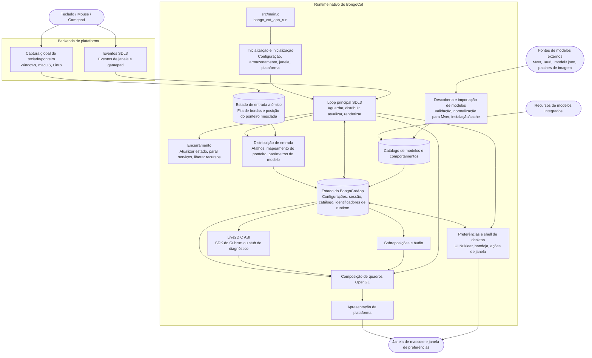

<div align="center">
  <a href="https://bongocat.pet" target="_blank">
    
  </a>
  <h1><a href="https://bongocat.pet" target="_blank">BongoCat</a></h1>
</div>

<p align="center">💘 C/C++ × SDL3 × OpenGL, misture tudo e bata à vontade! Bong~ Bongo Cat!!!</p>
<p align="center">
  Escolha o idioma ❯ <a href="https://github.com/vladelaina/BongoCat/blob/main/README.md">English</a> • <a href="https://github.com/vladelaina/BongoCat/blob/main/docs/README.zh-CN.md">简体中文</a> • <a href="https://github.com/vladelaina/BongoCat/blob/main/docs/README.zh-Hant.md">繁體中文</a> • <a href="https://github.com/vladelaina/BongoCat/blob/main/docs/README.fr-FR.md">Français</a> • <a href="https://github.com/vladelaina/BongoCat/blob/main/docs/README.de-DE.md">Deutsch</a> • <a href="https://github.com/vladelaina/BongoCat/blob/main/docs/README.ja-JP.md">日本語</a> • <a href="https://github.com/vladelaina/BongoCat/blob/main/docs/README.ko-KR.md">한국어</a> • <strong>Português</strong> • <a href="https://github.com/vladelaina/BongoCat/blob/main/docs/README.ru-RU.md">Русский</a> • <a href="https://github.com/vladelaina/BongoCat/blob/main/docs/README.es-ES.md">Español</a> • <a href="https://github.com/vladelaina/BongoCat/blob/main/docs/README.id-ID.md">Bahasa Indonesia</a>
</p>
<p align="center">
  <a href="https://github.com/vladelaina/BongoCat/blob/main/LICENSE"></a>
  <a href="https://github.com/vladelaina/BongoCat"></a>
  <a href="https://discord.gg/vf8jqnattk"></a>
  <a href="https://github.com/vladelaina/BongoCat/blob/main/docs/wechat.png"></a>
  <a href="https://qm.qq.com/q/cYlRBbvuda"></a>
</p>

<div align="center"><video src="https://github.com/user-attachments/assets/75719230-9e49-4124-ae5a-8e35592c5d49" autoplay loop style="border-radius: 8px; max-width: 800px;"></video></div>

> [!TIP]
> O modelo usado na demonstração é de [宇痕冫](https://space.bilibili.com/348616056).
>
> 🎁 Procurando modelos **gratuitos**? Trabalhamos com criadores de modelos talentosos para trazer uma grande variedade de modelos gratuitos, enquanto exploramos continuamente experiências de desktop ainda mais divertidas! Visite nosso site oficial: [bongocat.pet](https://bongocat.pet/models)

<p align="center">
  <a href="https://bongocat.pet/models">
    
  </a>
</p>

<p align="center"></p>

## 📥 Download

<a href="https://apps.microsoft.com/detail/9p41mlsx72xw?referrer=appbadge" target="_self"></a>

- GitHub Releases

  Baixe a versão mais recente nas [GitHub Releases](https://github.com/vladelaina/BongoCat/releases/latest).

## 🛠️ Compilar a partir do código-fonte

O BongoCat usa CMake e requer um compilador C11, um compilador C++17, CMake 3.24 ou superior e os arquivos de desenvolvimento de OpenGL para desktop. Por padrão, SDL3, yyjson, stb, miniaudio e Nuklear são baixados automaticamente durante a configuração, portanto a primeira configuração requer conexão com a internet.

Execute os comandos abaixo na raiz do projeto (o diretório que contém `CMakeLists.txt`).

### 📋 Pré-requisitos por plataforma

- **Windows:** Visual Studio 2022 (com a carga de trabalho ‘Desenvolvimento para desktop com C++’) e CMake. Use o gerador MSVC; o MinGW pode compilar o backend de diagnóstico, mas não suporta o SDK do Cubism.
- **macOS:** Xcode Command Line Tools, CMake e Ninja. Se a arquitetura de destino for diferente da padrão do host, especifique-a por meio de `CMAKE_OSX_ARCHITECTURES`.
- **Linux (Debian/Ubuntu):** GCC ou Clang, Ninja e os cabeçalhos de OpenGL/X11:

  ```bash
  sudo apt-get update
  sudo apt-get install -y build-essential cmake ninja-build \
    libgl1-mesa-dev libx11-dev libxi-dev libxfixes-dev libcurl4-openssl-dev
  ```

### 🔧 Configuração e compilação

No Linux e no macOS, use um gerador de configuração única como o Ninja:

```bash
cmake -S . -B build -G Ninja \
  -DCMAKE_BUILD_TYPE=Release \
  -DBONGO_CAT_FETCH_DEPS=ON
cmake --build build --parallel
```

No Windows, execute os comandos no Prompt de Comando do Desenvolvedor do Visual Studio 2022 (ou em qualquer shell em que o MSVC esteja disponível):

```powershell
cmake -S . -B build -G "Visual Studio 17 2022" -A x64 `
  -DBONGO_CAT_FETCH_DEPS=ON
cmake --build build --config Release --parallel
```

O executável fica em `build/BongoCat` no Linux, em `build/BongoCat.app/Contents/MacOS/BongoCat` no macOS e em `build/Release/BongoCat.exe` para compilações do Visual Studio no Windows.

### 🧪 Testes

Os alvos do CTest estão habilitados por padrão. Execute o seguinte após compilar:

```bash
ctest --test-dir build --output-on-failure
```

Para um gerador de múltiplas configurações, como o Visual Studio, especifique explicitamente a configuração de compilação:

```powershell
ctest --test-dir build -C Release --output-on-failure
```

### 🎭 Live2D / SDK do Cubism (opcional)

Se o SDK do Cubism não for encontrado, o CMake emitirá um aviso e compilará o backend de diagnóstico. Esse backend é destinado à inicialização e ao diagnóstico de plataforma; ele não fornece renderização de modelos Live2D. Para compilar o runtime completo, instale uma versão compatível do Cubism SDK for Native, coloque-a em `vendor/CubismSdkForNative` ou informe o caminho explicitamente:

```bash
cmake -S . -B build -G Ninja \
  -DCMAKE_BUILD_TYPE=Release \
  -DBONGO_CAT_CUBISM_SDK=/path/to/CubismSdkForNative \
  -DBONGO_CAT_REQUIRE_CUBISM=ON
```

O SDK deve incluir a biblioteca Core, o código-fonte do Framework e o diretório de terceiros do OpenGL GLEW na estrutura esperada por `cmake/Cubism.cmake`. As compilações de Cubism no Windows exigem o Visual Studio 2022. Com `BONGO_CAT_REQUIRE_CUBISM=ON`, a configuração falha quando o SDK não está disponível, em vez de selecionar silenciosamente o backend de diagnóstico.

### ⚙️ Opções do CMake

| Opção | Valor padrão | Descrição |
| --- | --- | --- |
| `BONGO_CAT_FETCH_DEPS` | `ON` | Baixa dependências de terceiros em versões fixadas via `FetchContent` do CMake. Defina como `OFF` apenas se SDL3, yyjson, stb, miniaudio e Nuklear já estiverem disponíveis para o CMake. |
| `BONGO_CAT_CUBISM_SDK` | `vendor/CubismSdkForNative` | Caminho para o Cubism SDK for Native. |
| `BONGO_CAT_REQUIRE_CUBISM` | `OFF` | Faz a configuração falhar quando não há SDK disponível. |
| `BONGO_CAT_WARNINGS_AS_ERRORS` | `OFF` | Trata avisos do compilador nativo como erros. |

Para uma compilação offline, defina `BONGO_CAT_FETCH_DEPS=OFF` e forneça as configurações de pacote do CMake para SDL3 (incluindo `SDL3-static`) e yyjson; se stb, Nuklear e miniaudio não puderem ser detectados automaticamente, informe também seus diretórios de inclusão:

```bash
cmake -S . -B build -G Ninja \
  -DCMAKE_BUILD_TYPE=Release \
  -DBONGO_CAT_FETCH_DEPS=OFF \
  -DBONGO_CAT_STB_INCLUDE_DIR=/path/to/stb \
  -DBONGO_CAT_NUKLEAR_INCLUDE_DIR=/path/to/nuklear \
  -DBONGO_CAT_MINIAUDIO_INCLUDE_DIR=/path/to/miniaudio
```

## 📌 Status do projeto


## 📜 Licença

O código-fonte e o runtime nativo do BongoCat estão licenciados sob [AGPL-3.0-only](../LICENSE).

O modo de modelo integrado padrão (`standard`) permanece sob a licença MIT. Os recursos de modelo incluídos em `resources/assets/models/standard`, `keyboard` e `gamepad` são cobertos pela [declaração de licença MIT](../LICENSE-MIT) separada. Essa licença MIT se aplica apenas aos recursos dos modelos e às artes que os acompanham; ela não altera a licença do código-fonte nem do runtime nativo do BongoCat.

## 🧭 Arquitetura técnica

A versão nativa atual é construída com C/C++, SDL3 e OpenGL. O diagrama abaixo destaca o fluxo de dados em tempo de execução; consulte os arquivos do CMake para obter detalhes de compilação e empacotamento.

### 🔄 Propriedade do runtime e agendamento de quadros

Cada processo possui uma instância de `BongoCatApp` e um loop de eventos/renderização no thread principal. Os listeners de plataforma param na fronteira de entrada:

```text
Listeners de plataforma (teclado/ponteiro)
            |
            v
  Estado de entrada C11 (fila atômica de bordas + posição do ponteiro mesclada)
            |
            v
  aplicação no thread principal <----- eventos SDL3
            |
            v
  parâmetros do modelo, sobreposições e estado da interface
            |
            v
  atualização do modelo -> composição OpenGL -> apresentação da plataforma
```

Os hooks de baixo nível do Windows, o tap de eventos Quartz do macOS e os listeners XInput2 do Linux são executados fora do loop principal. Eles publicam bordas de teclas e botões do mouse com carimbo de data/hora em uma fila atômica limitada e publicam as coordenadas do ponteiro por meio de um slot de mesclagem independente; após uma publicação bem-sucedida, um evento de ativação SDL nativo é enviado, evitando que eventos de movimento de alta frequência desloquem as bordas ordenadas de teclas e botões. No Windows, o DirectInput é usado pela interface de ponteiro da plataforma apenas quando o modelo solicita movimento relativo. Os eventos de janela, preferências e gamepad do SDL3 são processados no thread principal; os eventos de gamepad são normalizados antes de serem passados aos parâmetros do modelo ou atalhos. Nenhum listener de plataforma chama diretamente o código de Live2D, sobreposições ou interface.

`bongo_cat_app_run` trata dos parâmetros de atualização, encerramento e processos secundários, impõe a propriedade de instância única do processo principal, aloca o estado do aplicativo, executa a inicialização, entra em `bongo_cat_app_loop` e, em seguida, atualiza o estado e destrói os recursos na ordem definida. A inicialização carrega a configuração e os caminhos de armazenamento, localiza os recursos, cria a janela de mascote SDL/OpenGL, inicializa os backends de plataforma, cria os serviços de Live2D/sobreposições/áudio, verifica fontes de modelos integradas/instaladas/próximas e carrega os modelos disponíveis. `BongoCatApp` mantém as configurações, o estado da sessão, os catálogos de modelos e comportamentos, os identificadores de plataforma e os identificadores de serviços de runtime.

Os pacotes de modelos instalados usam Mver como formato canônico. O processo de importação analisa o arquivo ou diretório selecionado, descobre e valida candidatos, gera uma impressão digital de identidade do pacote, converte fontes Tauri em Mver, aplica patches de imagem e envia o pacote normalizado para `models_root`. Em seguida, os adaptadores de runtime são gerados e o catálogo é atualizado. Fontes próximas são descobertas apenas sem instalar a árvore de origem; seus adaptadores e resultados de verificação são armazenados em cache sob `cache_root`, fora de `models_root`.

Cada iteração do loop principal espera ativações SDL/nativas ou o vencimento mais cedo dos prazos de quadro, interface, animação e acerto do ponteiro (máximo de 250 ms). O loop distribui os eventos SDL enfileirados, esvazia a fila de entrada atômica e executa a recuperação de liberação, atualiza o estado da janela e da atualização do modelo e, em seguida, aplica os parâmetros de entrada. Com o Cubism habilitado, o prazo do modelo segue `settings.model.max_fps` (padrão de 60 FPS); builds de diagnóstico usam um intervalo de reserva de 100 ms. O tempo decorrido do modelo é contado no máximo como 250 ms e dividido em até oito subetapas, cada uma com o objetivo de não mais que 1/30 de segundo.

O caminho normal da mascote é renderizado apenas quando a janela está visível, não minimizada e marcada como suja. Cada quadro primeiro limpa o fundo, desenha o modelo e então compõe as sobreposições de ponteiro, teclas e efeitos, e finalmente chama o apresentador da plataforma. As operações de visualização podem solicitar renderização imediata; a renderização de capturas de tela pode pular a apresentação. macOS e Linux trocam diretamente a janela SDL OpenGL; o Windows a troca diretamente quando a apresentação em camadas não está habilitada; caso contrário, lê o buffer de quadros e chama `UpdateLayeredWindow`. A interface de preferências tem sua própria janela SDL/OpenGL e é renderizada e apresentada separadamente.

O runtime C chama a ABI declarada em `include/bongo_cat/model.h`. A ponte Live2D e a implementação do Cubism estão em `src/live2d` e usam C++17 apenas quando o SDK do Cubism está habilitado; o restante do runtime nativo usa C11. Os tipos do Cubism são mantidos atrás de identificadores C opacos; quando o SDK não está disponível, `src/live2d/live2d_stub.c` fornece o backend de diagnóstico.



## ❓ Perguntas frequentes

### 🔒 O BongoCat registra minhas entradas de teclado ou mouse?

Não. O BongoCat processa entradas de teclado e mouse localmente para impulsionar animações e atalhos. Ele não registra nem envia teclas pressionadas, ações do mouse ou outros dados de interação. A configuração também é salva apenas localmente; o aplicativo não contém anúncios, ferramentas de análise nem código de rastreamento de usuários. Ao verificar atualizações, apenas metadados públicos de versão são solicitados; nenhum dado de entrada, configuração ou uso é enviado.

### 🖼️ Por que OpenGL em vez de Vulkan?

Não porque Vulkan seja ruim, mas porque o BongoCat não precisa desse nível de complexidade. O aplicativo renderiza principalmente um modelo Live2D, algumas camadas de interface e uma janela de desktop transparente; o OpenGL dá conta disso facilmente e se integra naturalmente com o SDL3 e o renderizador OpenGL do Cubism. Migrar para Vulkan exigiria manter mais código de renderização e sincronização em três plataformas de desktop, sem benefício perceptível para o usuário. Para a carga de trabalho atual do BongoCat, o OpenGL torna o renderizador mais enxuto, mais fácil de depurar e manter, continuando a oferecer o desempenho necessário.

## 🙏 Agradecimentos especiais
> [!TIP]
> Cada passo do BongoCat é movido pelo espírito do código aberto. Agradecemos sinceramente a todos os colaboradores da comunidade por suas contribuições altruístas (listadas abaixo em ordem cronológica de contribuição). É o apoio de vocês que torna a companhia no desktop mais livre e genuína.❤️‍🔥


<a href="https://bongocat.pet">
    
</a>


[linux.do](https://linux.do/t/topic/2845597)
---

<div align="center">
Copyright © 2026 - **BongoCat**<br>
By vladelaina<br>
Made with ❤️ & ⌨️
</div>
