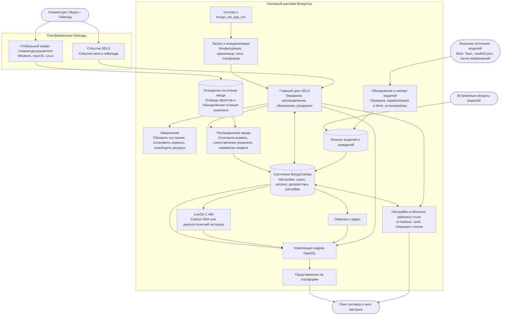

<div align="center">
  <a href="https://bongocat.pet" target="_blank">
    
  </a>
  <h1><a href="https://bongocat.pet" target="_blank">BongoCat</a></h1>
</div>

<p align="center">💘 C/C++ × SDL3 × OpenGL — смешай всё и барабань в своё удовольствие! Бонг~ Bongo Cat!!!</p>
<p align="center">
  Выберите язык ❯ <a href="https://github.com/vladelaina/BongoCat/blob/main/README.md">English</a> • <a href="https://github.com/vladelaina/BongoCat/blob/main/docs/README.zh-CN.md">简体中文</a> • <a href="https://github.com/vladelaina/BongoCat/blob/main/docs/README.zh-Hant.md">繁體中文</a> • <a href="https://github.com/vladelaina/BongoCat/blob/main/docs/README.fr-FR.md">Français</a> • <a href="https://github.com/vladelaina/BongoCat/blob/main/docs/README.de-DE.md">Deutsch</a> • <a href="https://github.com/vladelaina/BongoCat/blob/main/docs/README.ja-JP.md">日本語</a> • <a href="https://github.com/vladelaina/BongoCat/blob/main/docs/README.ko-KR.md">한국어</a> • <a href="https://github.com/vladelaina/BongoCat/blob/main/docs/README.pt-BR.md">Português</a> • <strong>Русский</strong> • <a href="https://github.com/vladelaina/BongoCat/blob/main/docs/README.es-ES.md">Español</a> • <a href="https://github.com/vladelaina/BongoCat/blob/main/docs/README.id-ID.md">Bahasa Indonesia</a>
</p>
<p align="center">
  <a href="https://github.com/vladelaina/BongoCat/blob/main/LICENSE"></a>
  <a href="https://github.com/vladelaina/BongoCat"></a>
  <a href="https://discord.gg/vf8jqnattk"></a>
  <a href="https://github.com/vladelaina/BongoCat/blob/main/docs/wechat.png"></a>
  <a href="https://qm.qq.com/q/cYlRBbvuda"></a>
</p>

<div align="center"><video src="https://github.com/user-attachments/assets/75719230-9e49-4124-ae5a-8e35592c5d49" autoplay loop style="border-radius: 8px; max-width: 800px;"></video></div>

> [!TIP]
> Модель, использованная в демо, принадлежит [宇痕冫](https://space.bilibili.com/348616056).
>
> 🎁 Ищете **бесплатные** модели? Мы сотрудничаем с талантливыми создателями моделей, чтобы предложить вам широкий выбор бесплатных моделей, и постоянно исследуем новые интересные возможности для рабочего стола! Загляните на наш официальный сайт: [bongocat.pet](https://bongocat.pet/models)

<p align="center">
  <a href="https://bongocat.pet/models">
    
  </a>
</p>

<p align="center"></p>

## 📥 Загрузка

<a href="https://apps.microsoft.com/detail/9p41mlsx72xw?referrer=appbadge" target="_self"></a>

- GitHub Releases

  Скачайте последнюю версию из [GitHub Releases](https://github.com/vladelaina/BongoCat/releases/latest).

## 🛠️ Сборка из исходного кода

BongoCat использует CMake и требует компилятор C11, компилятор C++17, CMake 3.24 или новее, а также файлы разработки OpenGL для настольных систем. По умолчанию SDL3, yyjson, stb, miniaudio и Nuklear загружаются автоматически на этапе конфигурации, поэтому для первой настройки требуется подключение к сети.

Выполните следующие команды в корневом каталоге проекта (каталоге, содержащем `CMakeLists.txt`).

### 📋 Предварительные требования по платформам

- **Windows:** Visual Studio 2022 (с рабочей нагрузкой «Разработка классических приложений на C++») и CMake. Используйте генератор MSVC; MinGW может собрать диагностический бэкенд, но не поддерживает Cubism SDK.
- **macOS:** Xcode Command Line Tools, CMake и Ninja. Если целевая архитектура отличается от архитектуры хоста по умолчанию, укажите её через `CMAKE_OSX_ARCHITECTURES`.
- **Linux (Debian/Ubuntu):** GCC или Clang, Ninja, а также заголовочные файлы OpenGL/X11:

  ```bash
  sudo apt-get update
  sudo apt-get install -y build-essential cmake ninja-build \
    libgl1-mesa-dev libx11-dev libxi-dev libxfixes-dev libcurl4-openssl-dev
  ```

### 🔧 Настройка и сборка

В Linux и macOS используйте генератор с одной конфигурацией, например Ninja:

```bash
cmake -S . -B build -G Ninja \
  -DCMAKE_BUILD_TYPE=Release \
  -DBONGO_CAT_FETCH_DEPS=ON
cmake --build build --parallel
```

В Windows выполняйте команды из командной строки разработчика Visual Studio 2022 (или любой другой оболочки, где доступен MSVC):

```powershell
cmake -S . -B build -G "Visual Studio 17 2022" -A x64 `
  -DBONGO_CAT_FETCH_DEPS=ON
cmake --build build --config Release --parallel
```

Исполняемый файл находится в `build/BongoCat` в Linux, в `build/BongoCat.app/Contents/MacOS/BongoCat` в macOS и в `build/Release/BongoCat.exe` для сборок Visual Studio в Windows.

### 🧪 Тестирование

Цели CTest включены по умолчанию. После сборки выполните:

```bash
ctest --test-dir build --output-on-failure
```

Для генератора с несколькими конфигурациями, такого как Visual Studio, явно укажите конфигурацию сборки:

```powershell
ctest --test-dir build -C Release --output-on-failure
```

### 🎭 Live2D / Cubism SDK (необязательно)

Если Cubism SDK не найден, CMake выдаст предупреждение и соберёт диагностический бэкенд. Этот бэкенд предназначен для запуска и диагностики платформы; он не обеспечивает рендеринг моделей Live2D. Чтобы собрать полный рантайм, установите совместимую версию Cubism SDK for Native, поместите её в `vendor/CubismSdkForNative` или явно укажите путь:

```bash
cmake -S . -B build -G Ninja \
  -DCMAKE_BUILD_TYPE=Release \
  -DBONGO_CAT_CUBISM_SDK=/path/to/CubismSdkForNative \
  -DBONGO_CAT_REQUIRE_CUBISM=ON
```

SDK должен включать библиотеку Core, исходный код Framework и каталог сторонних библиотек OpenGL GLEW в структуре, ожидаемой `cmake/Cubism.cmake`. Сборки Cubism в Windows требуют Visual Studio 2022. При `BONGO_CAT_REQUIRE_CUBISM=ON` конфигурация завершится ошибкой, если SDK недоступен, а не будет молча использовать диагностический бэкенд.

### ⚙️ Параметры CMake

| Параметр | По умолчанию | Описание |
| --- | --- | --- |
| `BONGO_CAT_FETCH_DEPS` | `ON` | Загружает сторонние зависимости фиксированных версий через `FetchContent` CMake. Установите `OFF`, только если SDL3, yyjson, stb, miniaudio и Nuklear уже доступны для CMake. |
| `BONGO_CAT_CUBISM_SDK` | `vendor/CubismSdkForNative` | Путь к Cubism SDK for Native. |
| `BONGO_CAT_REQUIRE_CUBISM` | `OFF` | Завершает конфигурацию ошибкой, если SDK недоступен. |
| `BONGO_CAT_WARNINGS_AS_ERRORS` | `OFF` | Обрабатывает предупреждения нативного компилятора как ошибки. |

Для автономной сборки установите `BONGO_CAT_FETCH_DEPS=OFF` и предоставьте конфигурации пакетов CMake для SDL3 (включая `SDL3-static`) и yyjson; если stb, Nuklear и miniaudio не могут быть найдены автоматически, укажите также их каталоги включения:

```bash
cmake -S . -B build -G Ninja \
  -DCMAKE_BUILD_TYPE=Release \
  -DBONGO_CAT_FETCH_DEPS=OFF \
  -DBONGO_CAT_STB_INCLUDE_DIR=/path/to/stb \
  -DBONGO_CAT_NUKLEAR_INCLUDE_DIR=/path/to/nuklear \
  -DBONGO_CAT_MINIAUDIO_INCLUDE_DIR=/path/to/miniaudio
```

## 📌 Статус проекта


## 📜 Лицензия

Исходный код и нативный рантайм BongoCat распространяются под лицензией [AGPL-3.0-only](../LICENSE).

Встроенный по умолчанию режим модели (`standard`) остаётся под лицензией MIT. Ресурсы моделей, входящие в `resources/assets/models/standard`, `keyboard` и `gamepad`, покрываются отдельным [объявлением о лицензии MIT](../LICENSE-MIT). Эта лицензия MIT распространяется только на ресурсы моделей и сопутствующие художественные материалы; она не меняет лицензию исходного кода или нативного рантайма BongoCat.

## 🧭 Техническая архитектура

Текущая нативная версия построена на C/C++, SDL3 и OpenGL. Диаграмма ниже акцентирует поток данных во время выполнения; подробности сборки и упаковки см. в файлах CMake.

### 🔄 Владение рантаймом и планирование кадров

Каждый процесс владеет экземпляром `BongoCatApp` и циклом событий/рендеринга в главном потоке. Платформенные слушатели останавливаются на границе ввода:

```text
Платформенные слушатели (клавиатура/указатель)
            |
            v
  Состояние ввода C11 (атомарная очередь фронтов + объединённая позиция указателя)
            |
            v
  приложение в главном потоке <----- события SDL3
            |
            v
  параметры модели, оверлеи и состояние интерфейса
            |
            v
  обновление модели -> композиция OpenGL -> представление на платформе
```

Низкоуровневые хуки Windows, обработчик событий Quartz в macOS и слушатели XInput2 в Linux работают вне главного цикла. Они публикуют нажатия клавиш и фронты кнопок мыши с отметками времени в ограниченную атомарную очередь и публикуют координаты указателя через отдельный слот объединения; после успешной публикации отправляется нативное событие пробуждения SDL, что не позволяет высокочастотным событиям движения вытеснять упорядоченные фронты клавиш и кнопок. В Windows DirectInput используется через интерфейс указателя платформы только тогда, когда модель запрашивает относительное движение. События окна, настроек и геймпада SDL3 обрабатываются в главном потоке; события геймпада нормализуются перед передачей параметрам модели или сочетаниям клавиш. Ни один платформенный слушатель не вызывает напрямую код Live2D, оверлеев или интерфейса.

`bongo_cat_app_run` обрабатывает параметры обновления, завершения и вторичных процессов, обеспечивает владение единственным экземпляром главного процесса, выделяет состояние приложения, выполняет инициализацию, входит в `bongo_cat_app_loop`, а затем обновляет состояние и уничтожает ресурсы в определённом порядке. Инициализация загружает конфигурацию и пути хранения, находит ресурсы, создаёт окно питомца SDL/OpenGL, инициализирует платформенные бэкенды, создаёт сервисы Live2D/оверлеев/аудио, сканирует встроенные/установленные/близлежащие источники моделей и загружает доступные модели. `BongoCatApp` хранит настройки, состояние сеанса, каталоги моделей и поведения, дескрипторы платформы и дескрипторы сервисов рантайма.

Установленные пакеты моделей используют Mver в качестве канонического формата. Процесс импорта анализирует выбранный файл или каталог, обнаруживает и проверяет кандидатов, формирует отпечаток идентичности пакета, преобразует источники Tauri в Mver, применяет патчи изображений и отправляет нормализованный пакет в `models_root`. Затем создаются адаптеры рантайма и обновляется каталог. Близлежащие источники обнаруживаются без установки их дерева исходников; их адаптеры и результаты проверок кэшируются в `cache_root` за пределами `models_root`.

Каждая итерация главного цикла ожидает пробуждения SDL/нативных событий или самого раннего срока кадра, интерфейса, анимации и попадания указателя (максимум 250 мс). Цикл распределяет поставленные в очередь события SDL, очищает атомарную очередь ввода и выполняет восстановление освобождений, обновляет состояние окна и обновления модели, а затем применяет входные параметры. При включённом Cubism срок модели следует `settings.model.max_fps` (по умолчанию 60 FPS); диагностические сборки используют резервный интервал 100 мс. Прошедшее время модели учитывается максимум 250 мс и делится на до восьми подшагов, каждый из которых не превышает 1/30 секунды.

Обычный путь питомца рендерится только тогда, когда окно видимо, не свёрнуто и помечено как изменённое. Каждый кадр сначала очищает фон, рисует модель, затем компонует оверлеи указателя, клавиш и эффектов и, наконец, вызывает презентер платформы. Операции предпросмотра могут запросить немедленный рендеринг; рендеринг скриншотов может пропустить представление. macOS и Linux напрямую обменивают окно SDL OpenGL; Windows обменивает его напрямую, если многослойное представление не включено, в противном случае считывает кадровый буфер и вызывает `UpdateLayeredWindow`. Интерфейс настроек имеет собственное окно SDL/OpenGL и рендерится и представляется отдельно.

Среда выполнения C вызывает ABI, объявленный в `include/bongo_cat/model.h`. Мост Live2D и реализация Cubism находятся в `src/live2d` и используют C++17 только при включённом Cubism SDK; остальной нативный рантайм использует C11. Типы Cubism остаются за непрозрачными дескрипторами C; когда SDK недоступен, `src/live2d/live2d_stub.c` предоставляет диагностический бэкенд.



## ❓ Часто задаваемые вопросы

### 🔒 Записывает ли BongoCat мой ввод с клавиатуры или мыши?

Нет. BongoCat обрабатывает ввод с клавиатуры и мыши локально для управления анимациями и сочетаниями клавиш. Он не записывает и не загружает нажатия клавиш, действия мыши или другие данные взаимодействия. Конфигурация также сохраняется только локально; приложение не содержит рекламы, аналитических инструментов или кода отслеживания пользователей. При проверке обновлений запрашиваются только публичные метаданные версии; никакие данные ввода, конфигурации или использования не отправляются.

### 🖼️ Почему OpenGL, а не Vulkan?

Не потому что Vulkan плох, а потому что BongoCat не нуждается в такой сложности. Приложение в основном рендерит одну модель Live2D, несколько слоёв интерфейса и прозрачное окно рабочего стола; OpenGL легко справляется с этим и естественно сочетается с SDL3 и рендерером OpenGL от Cubism. Переход на Vulkan потребовал бы поддержки большего объёма кода рендеринга и синхронизации на трёх настольных платформах без заметного преимущества для пользователя. Для текущей нагрузки BongoCat OpenGL делает рендерер более компактным, лёгким в отладке и обслуживании, сохраняя при этом необходимую производительность.

## 🙏 Особая благодарность
> [!TIP]
> Каждый шаг BongoCat вдохновлён духом открытого исходного кода. Мы искренне благодарим всех участников сообщества за их бескорыстный вклад (перечислен ниже в хронологическом порядке). Именно ваша поддержка делает настольного спутника более свободным и искренним.❤️‍🔥


<a href="https://bongocat.pet">
    
</a>


[linux.do](https://linux.do/t/topic/2845597)
---

<div align="center">
Авторские права © 2026 - **BongoCat**<br>
By vladelaina<br>
Made with ❤️ & ⌨️
</div>
