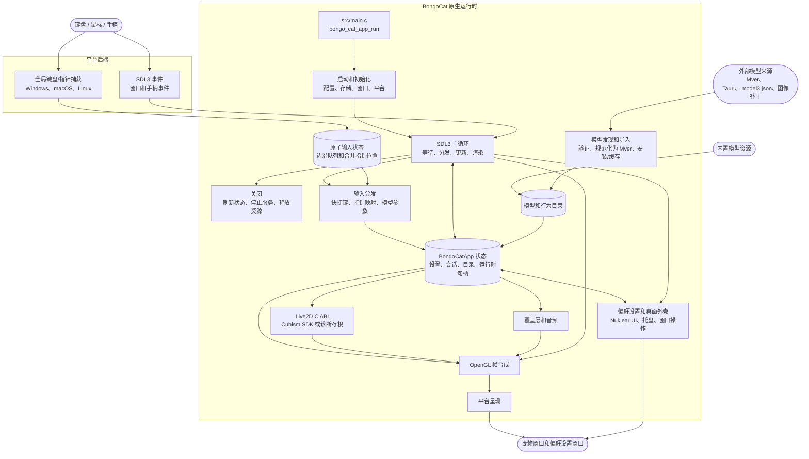

<div align="center">
  <a href="https://bongocat.pet" target="_blank">
    
  </a>
  <h1><a href="https://bongocat.pet" target="_blank">BongoCat</a></h1>
</div>

<p align="center">💘 C/C++ × SDL3 × OpenGL，搅拌在一起，尽情敲击！Bong~ Bongo Cat!!!</p>
<p align="center">
  选择语言 ❯ <a href="https://github.com/vladelaina/BongoCat/blob/main/README.md">English</a> • <strong>简体中文</strong> • <a href="https://github.com/vladelaina/BongoCat/blob/main/docs/README.zh-Hant.md">繁體中文</a> • <a href="https://github.com/vladelaina/BongoCat/blob/main/docs/README.fr-FR.md">Français</a> • <a href="https://github.com/vladelaina/BongoCat/blob/main/docs/README.de-DE.md">Deutsch</a> • <a href="https://github.com/vladelaina/BongoCat/blob/main/docs/README.ja-JP.md">日本語</a> • <a href="https://github.com/vladelaina/BongoCat/blob/main/docs/README.ko-KR.md">한국어</a> • <a href="https://github.com/vladelaina/BongoCat/blob/main/docs/README.pt-BR.md">Português</a> • <a href="https://github.com/vladelaina/BongoCat/blob/main/docs/README.ru-RU.md">Русский</a> • <a href="https://github.com/vladelaina/BongoCat/blob/main/docs/README.es-ES.md">Español</a> • <a href="https://github.com/vladelaina/BongoCat/blob/main/docs/README.id-ID.md">Bahasa Indonesia</a>
</p>
<p align="center">
  <a href="https://github.com/vladelaina/BongoCat/blob/main/LICENSE"></a>
  <a href="https://github.com/vladelaina/BongoCat"></a>
  <a href="https://discord.gg/vf8jqnattk"></a>
  <a href="https://github.com/vladelaina/BongoCat/blob/main/docs/wechat.png"></a>
  <a href="https://qm.qq.com/q/cYlRBbvuda"></a>
</p>

<div align="center"><video src="https://github.com/user-attachments/assets/75719230-9e49-4124-ae5a-8e35592c5d49" autoplay loop style="border-radius: 8px; max-width: 800px;"></video></div>

> [!TIP]
> 演示中使用的模型来自 [宇痕冫](https://space.bilibili.com/348616056)。
>
> 🎁 想找**免费**模型？我们与才华横溢的模型创作者合作，为您带来丰富多样的免费模型，同时持续探索更多有趣的桌面体验！欢迎访问我们的官方网站：[bongocat.pet](https://bongocat.pet/models)

<p align="center">
  <a href="https://bongocat.pet/models">
    
  </a>
</p>

<p align="center"></p>

## 📥 下载

<a href="https://apps.microsoft.com/detail/9p41mlsx72xw?referrer=appbadge" target="_self"></a>

- GitHub Releases

  从 [GitHub Releases](https://github.com/vladelaina/BongoCat/releases/latest) 下载最新版本。

## 🛠️ 从源码构建

BongoCat 使用 CMake，需要 C11 编译器、C++17 编译器、CMake 3.24 或更高版本，以及桌面 OpenGL 开发文件。默认情况下，SDL3、yyjson、stb、miniaudio 和 Nuklear 会在配置阶段自动下载，因此首次配置需要网络连接。

请在项目根目录（包含 `CMakeLists.txt` 的目录）运行以下命令。

### 📋 平台前置条件

- **Windows：** Visual Studio 2022（安装“使用 C++ 的桌面开发”工作负载）和 CMake。请使用 MSVC 生成器；MinGW 可构建诊断后端，但不支持 Cubism SDK。
- **macOS：** Xcode Command Line Tools、CMake 和 Ninja。如果目标架构与主机默认架构不同，请通过 `CMAKE_OSX_ARCHITECTURES` 指定。
- **Linux（Debian/Ubuntu）：** GCC 或 Clang、Ninja，以及 OpenGL/X11 头文件：

  ```bash
  sudo apt-get update
  sudo apt-get install -y build-essential cmake ninja-build \
    libgl1-mesa-dev libx11-dev libxi-dev libxfixes-dev libcurl4-openssl-dev
  ```

### 🔧 配置与构建

在 Linux 和 macOS 上，请使用 Ninja 这样的单配置生成器：

```bash
cmake -S . -B build -G Ninja \
  -DCMAKE_BUILD_TYPE=Release \
  -DBONGO_CAT_FETCH_DEPS=ON
cmake --build build --parallel
```

在 Windows 上，请从 Visual Studio 2022 开发者命令行（或 MSVC 可用的其他命令行）运行：

```powershell
cmake -S . -B build -G "Visual Studio 17 2022" -A x64 `
  -DBONGO_CAT_FETCH_DEPS=ON
cmake --build build --config Release --parallel
```

可执行文件位于：Linux 的 `build/BongoCat`，macOS 的 `build/BongoCat.app/Contents/MacOS/BongoCat`，Visual Studio 构建的 Windows 版本为 `build/Release/BongoCat.exe`。

### 🧪 测试

CTest 目标默认启用。构建后运行：

```bash
ctest --test-dir build --output-on-failure
```

对于 Visual Studio 这类多配置生成器，请明确指定构建配置：

```powershell
ctest --test-dir build -C Release --output-on-failure
```

### 🎭 Live2D / Cubism SDK（可选）

如果未找到 Cubism SDK，CMake 会发出警告并构建诊断后端。该后端用于启动和平台诊断，不提供 Live2D 模型渲染。要构建完整运行时，请安装兼容的 Cubism SDK for Native，将其放置在 `vendor/CubismSdkForNative`，或显式传入路径：

```bash
cmake -S . -B build -G Ninja \
  -DCMAKE_BUILD_TYPE=Release \
  -DBONGO_CAT_CUBISM_SDK=/path/to/CubismSdkForNative \
  -DBONGO_CAT_REQUIRE_CUBISM=ON
```

SDK 必须包含 Core 库、Framework 源码，以及 `cmake/Cubism.cmake` 所要求布局中的 OpenGL GLEW 第三方目录。Windows Cubism 构建需要 Visual Studio 2022。`BONGO_CAT_REQUIRE_CUBISM=ON` 会在 SDK 不可用时使配置失败，而不是静默选择诊断后端。

### ⚙️ CMake 选项

| 选项 | 默认值 | 说明 |
| --- | --- | --- |
| `BONGO_CAT_FETCH_DEPS` | `ON` | 使用 CMake `FetchContent` 下载固定版本的第三方依赖。仅当 SDL3、yyjson、stb、miniaudio 和 Nuklear 已可供 CMake 使用时才设为 `OFF`。 |
| `BONGO_CAT_CUBISM_SDK` | `vendor/CubismSdkForNative` | Cubism SDK for Native 的路径。 |
| `BONGO_CAT_REQUIRE_CUBISM` | `OFF` | SDK 不可用时使配置失败。 |
| `BONGO_CAT_WARNINGS_AS_ERRORS` | `OFF` | 将本地编译器警告视为错误。 |

离线构建时将 `BONGO_CAT_FETCH_DEPS=OFF`，并提供 SDL3（包括 `SDL3-static`）和 yyjson 的 CMake 包配置；如果 stb、Nuklear 和 miniaudio 无法自动发现，还需提供其包含目录：

```bash
cmake -S . -B build -G Ninja \
  -DCMAKE_BUILD_TYPE=Release \
  -DBONGO_CAT_FETCH_DEPS=OFF \
  -DBONGO_CAT_STB_INCLUDE_DIR=/path/to/stb \
  -DBONGO_CAT_NUKLEAR_INCLUDE_DIR=/path/to/nuklear \
  -DBONGO_CAT_MINIAUDIO_INCLUDE_DIR=/path/to/miniaudio
```

## 📌 项目状态


## 📜 许可证

BongoCat 源代码和本地运行时采用 [AGPL-3.0-only](../LICENSE) 许可证。

默认内置模型模式（`standard`）仍采用 MIT 许可证。`resources/assets/models/standard`、`keyboard` 和 `gamepad` 中捆绑的模型资源受单独的 [MIT 许可证声明](../LICENSE-MIT) 覆盖。该 MIT 许可证仅适用于模型资源及其配套美术作品，不会改变 BongoCat 源代码或本地运行时的许可证。

## 🧭 技术架构

当前原生版本基于 C/C++、SDL3 和 OpenGL 构建。下图重点展示运行时数据流；构建与打包细节请参阅 CMake 文件。

### 🔄 运行时所有权与帧调度

每个进程拥有一个 `BongoCatApp` 和一个主线程事件/渲染循环。平台监听器在输入边界处停止：

```text
平台监听器（键盘/指针）
            |
            v
  C11 输入状态（原子边沿队列 + 合并后的指针位置）
            |
            v
  主线程应用 <----- SDL3 事件
            |
            v
  模型参数、覆盖层和 UI 状态
            |
            v
  模型更新 -> OpenGL 合成 -> 平台呈现
```

Windows 低级钩子、macOS Quartz 事件 tap 和 Linux XInput2 监听器运行在主循环之外。它们将带时间戳的按键和鼠标按钮边沿发布到有界原子队列，并通过独立的合并槽发布指针坐标；成功发布后会推送原生 SDL 唤醒事件，从而避免高频移动事件挤出有序的按键和按钮边沿。在 Windows 上，只有当模型请求相对移动时，才会通过平台指针接口使用 DirectInput。SDL3 窗口、偏好设置和手柄事件在主线程处理，手柄事件会先标准化再传递给模型参数或快捷键。任何平台监听器都不会直接调用 Live2D、覆盖层或 UI 代码。

`bongo_cat_app_run` 负责更新、关闭和次级进程参数，确保主进程的单实例所有权，分配应用状态，执行初始化，进入 `bongo_cat_app_loop`，随后按定义顺序刷新状态并销毁资源。初始化会加载配置和存储路径、定位资源、创建 SDL/OpenGL 宠物窗口、初始化平台后端、创建 Live2D/覆盖层/音频服务、扫描内置/已安装/附近的模型来源，并加载可用模型。`BongoCatApp` 持有设置、会话状态、模型和行为目录、平台句柄及运行时服务句柄。

已安装的模型包使用 Mver 作为规范格式。导入流程会解析选中的文件或目录，发现并验证候选项，生成包身份指纹，将 Tauri 来源转换为 Mver，应用图像补丁，并将规范化包提交到 `models_root`。随后生成运行时适配器并刷新目录。附近来源只在不安装源目录的情况下被发现；其适配器和检查结果缓存在 `models_root` 之外的 `cache_root` 下。

每次主循环迭代都会等待 SDL/原生唤醒，或等待最早的帧、UI、动画和指针命中截止时间（最长 250 毫秒）。循环分发排队的 SDL 事件，清空原子输入队列并执行释放恢复，更新窗口和模型刷新状态，然后应用输入参数。启用 Cubism 时，模型截止时间遵循 `settings.model.max_fps`（默认为 60 FPS）；诊断构建使用 100 毫秒的后备间隔。模型经过的时间最多计为 250 毫秒，并拆分为最多八个子步，每个子步目标不超过 1/30 秒。

常规宠物路径仅在窗口可见、未最小化且标记为脏时渲染。每帧先清空背景，绘制模型，再合成指针、按键和效果覆盖层，最后调用平台呈现器。预览操作可以请求立即渲染，截图渲染可以跳过呈现。macOS 和 Linux 直接交换 SDL OpenGL 窗口；Windows 在未启用分层呈现时直接交换，否则读取帧缓冲并调用 `UpdateLayeredWindow`。偏好设置 UI 拥有独立的 SDL/OpenGL 窗口，并单独渲染和呈现。

C 运行时调用 `include/bongo_cat/model.h` 中声明的 ABI。Live2D 桥接和 Cubism 实现在 `src/live2d` 中，仅在启用 Cubism SDK 时使用 C++17；其余本地运行时使用 C11。Cubism 类型保持在不透明 C 句柄之后；当 SDK 不可用时，`src/live2d/live2d_stub.c` 提供诊断后端。



## ❓ 常见问题

### 🔒 BongoCat 会记录我的键盘或鼠标输入吗？

不会。BongoCat 在本地处理键盘和鼠标输入，用于驱动动画和快捷键。它不会记录或上传按键、鼠标操作或其他交互数据。配置也只保存在本地，应用不包含广告、分析工具或用户跟踪代码。执行更新检查时只会请求公开的版本元数据，不会发送输入、配置或使用数据。

### 🖼️ 为什么使用 OpenGL 而不是 Vulkan？

这不是因为 Vulkan 不好，而是 BongoCat 不需要那种程度的复杂性。应用主要渲染一个 Live2D 模型、少量 UI 图层和透明桌面窗口，OpenGL 已能轻松满足需求，并且能自然地与 SDL3 及 Cubism 的 OpenGL 渲染器配合。迁移到 Vulkan 将需要在三个桌面平台维护更多渲染和同步代码，却不会为用户带来明显提升。对于 BongoCat 当前的工作负载，OpenGL 让渲染器更精简、更易调试和维护，同时仍能提供所需性能。

## 🙏 特别感谢
> [!TIP]
> BongoCat 的每一步都得益于开源精神。我们衷心感谢所有社区贡献者的无私奉献（按贡献日期先后排序列于下方）。正是你们的支持，让桌面陪伴更加自由与真诚。❤️‍🔥


<a href="https://bongocat.pet">
    
</a>


[linux.do](https://linux.do/t/topic/2845597)
---

<div align="center">
版权所有 © 2026 - **BongoCat**<br>
By vladelaina<br>
Made with ❤️ & ⌨️
</div>
